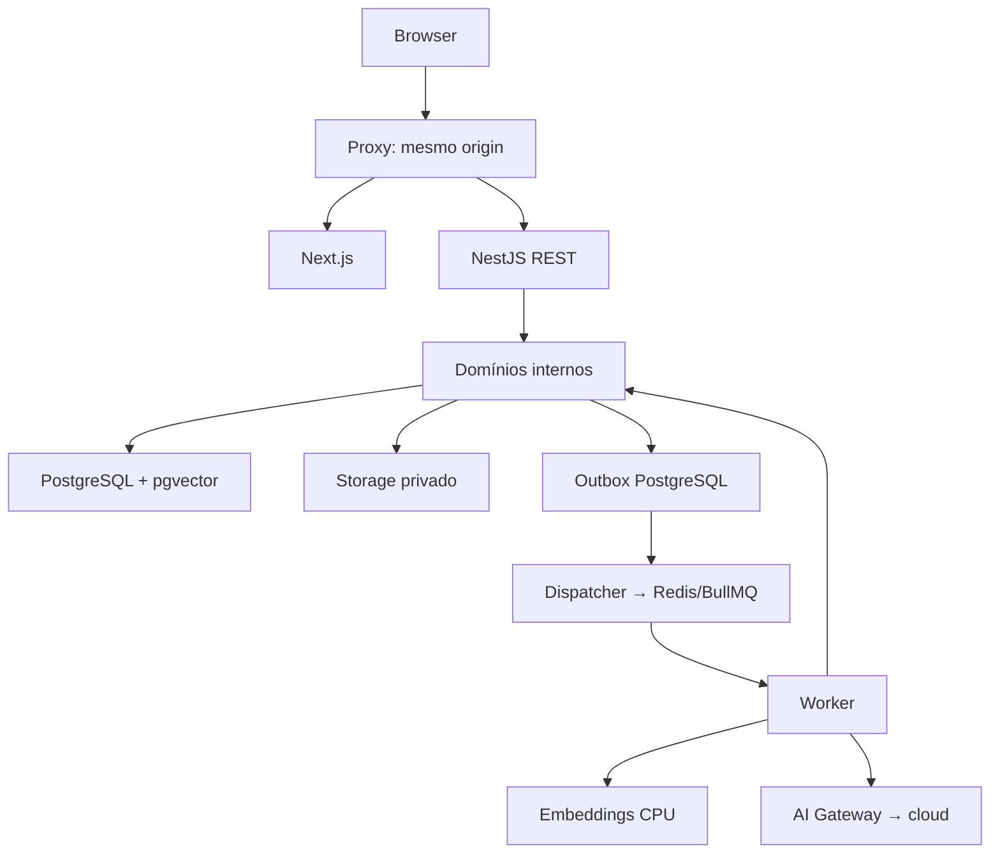

# Arquitetura

## Resumo executivo

Facilita Estudo centraliza disciplinas, turmas, materiais e estudo acadêmico por IA, com experiência docente para criação/revisão/exportação de avaliações e experiência estudantil para tutor, resumos, flashcards, simulados e revisão.

Prioridade estrutural: avaliações reais, gabaritos, prompts e derivados privados nunca chegam aos fluxos do aluno. Monólito modular com três processos; nenhum microserviço no MVP.

Workspace inspecionado em 02/10/2026: vazio, sem Git, tecnologias existentes ou dívida técnica identificável. Documentação não implica bootstrap executado.

## Escopo

Lançamento proposto: autenticação, disciplinas, turmas, PDF/PPTX, RAG, tutor, resumos, avaliações manuais/geradas, versões, StudyBlueprint, simulados, flashcards/plano/revisão, PDF/impressão, BYOK, quotas e observabilidade. IA da plataforma depende de validação contratual/financeira.

Posteriores: DOCX, PWA, administração institucional, pagamento automático, OCR e analytics avançado. Requisitos permanecem no roadmap, sem remoção silenciosa.

## Stack

| Camada | Escolha proposta |
|---|---|
| Web | Next.js App Router, React, TypeScript |
| UI | Tailwind CSS, shadcn/ui |
| API | NestJS, REST, TypeScript |
| Runtime | Node.js LTS compatível com frameworks |
| Banco | PostgreSQL self-hosted + pgvector |
| Persistência | Drizzle ORM + pg |
| Jobs | Redis + BullMQ |
| Storage | Filesystem privado via StorageProvider |
| Validação | Zod para contratos e respostas de IA |
| Auth | Sessão opaca, cookie HttpOnly, Argon2id |
| IA generativa BYOK | Ollama Cloud, HTTP server-side |
| Embeddings | Transformers.js/E5 no worker, adapter CPU |
| PDF | Adapter PDF.js; confirmar qualidade em spike |
| Slides | Adapter OOXML, ZIP/XML limitado |
| Export | HTML controlado → Chromium/PDF no worker |
| Testes | Vitest, integração HTTP/DB, Playwright |
| Observabilidade | Logs JSON, IDs, métricas e health |
| Monorepo | pnpm workspaces |
| Infra | Docker Compose |

Versões exatas/lockfile/matriz de compatibilidade: E02. Não usar beta por padrão. Comparação dos ORMs e alternativas de monorepo em [DECISIONS.md](DECISIONS.md).

FATO VERIFICADO: pnpm suporta monorepos via workspaces. DECISÃO NOSSA: não adicionar Turborepo/Nx inicialmente; reconsiderar por benefício medido. [pnpm](https://pnpm.io/workspaces).

## Topologia



Banco, storage, filas e IA são dependências laterais; não uma cadeia obrigatória sequencial.

## Responsabilidades

- Web: navegação, forms, estados de jobs, apresentação e acessibilidade.
- API: autenticação/autorização, DTOs, regras, transações e criação de jobs.
- Worker: parsing, embeddings, geração, resumo, exportação, limpeza e reconciliação.
- PostgreSQL: fonte de verdade de dados, jobs, quotas, auditoria e outbox.
- Redis: transporte/execução; não saldo comercial ou única cópia de job.
- Storage: arquivos originais e artefatos privados.
- Gateway: única entrada para chamadas generativas externas.

## Estrutura proposta

```text
apps/
  web/src/{app,features,components,lib,styles}/
  api/src/{controllers,http,composition}/
  api/src/main.ts
  worker/src/{processors,composition}/
  worker/src/main.ts
packages/
  backend/src/{identity,academic,materials,documents,assessments,study}/
  backend/src/{ai,rag,billing,exports,audit,platform}/
  database/src/{schema,repositories}/
  database/migrations/
  contracts/src/{http,jobs,errors,enums}/
  validation/src/ai/
  config/
  eslint-config/
  typescript-config/
infra/
  compose.yaml
  docker/
  scripts/
tests/
  integration/
  e2e/
  fixtures/
  evaluations/
docs/
.env.example
pnpm-workspace.yaml
package.json
pnpm-lock.yaml
```

`contracts` substitui `shared-types`: somente DTOs públicos e payloads técnicos. `backend` é pacote interno server-only, sem dependência entre apps.

## Fronteiras

- Web importa contracts; não backend/database/vault/providers.
- API/worker importam módulos por entradas públicas.
- Domínios não importam controllers/apps.
- SDKs ficam em adapters.
- Consultas entre domínios usam interfaces públicas.
- DTO não retorna entidade ORM diretamente.
- Configuração pública e server-only separadas.
- Evitar repository genérico e abstrações sem benefício concreto.

## Requisição síncrona

```text
requestId → sessão → CSRF (se mutável) → validação DTO
→ escopo/papel/ownership → entitlement → serviço de domínio
→ transação PostgreSQL → DTO explícito → resposta
```

## Operação assíncrona

```text
autorização → reserva de quota → Job + Outbox em transação
→ 202 → dispatcher BullMQ → worker reautoriza
→ execução/usage → resultado validado → commit idempotente
→ confirmação/liberação de quota → polling autorizado
```

Fila é ao menos uma vez; efeito de domínio deve ser idempotente. Não prometer exactly-once para chamadas externas ou cobrança do fornecedor.

FATO VERIFICADO: BullMQ orienta jobs simples/idempotentes para retries. DECISÃO NOSSA: outbox e reconciliação resolvem a fronteira DB/fila. [BullMQ](https://docs.bullmq.io/patterns/idempotent-jobs).

## Ambiente local

Portas: web 3000, API 3001, PostgreSQL 5432, Redis 6379. DB/Redis restritos a localhost no desenvolvimento, sem exposição pública em produção. Web/API/worker podem rodar fora do Docker durante desenvolvimento.

Comandos futuros, sujeitos à confirmação requerida:

```bash
docker compose -f infra/compose.yaml up -d
pnpm install
pnpm db:migrate
pnpm dev
```

Scripts ainda não existem; sua criação pertence à E02.

## Configuração prevista

```dotenv
NODE_ENV=development
APP_ORIGIN=http://localhost:3000
API_PORT=3001
DATABASE_URL=
DATABASE_MIGRATION_URL=
REDIS_URL=
QUEUE_PREFIX=facilita
STORAGE_DRIVER=local
STORAGE_PATH=
VAULT_ACTIVE_KEY_ID=
VAULT_KEYS_JSON=
OLLAMA_CLOUD_BASE_URL=https://ollama.com
PLATFORM_AI_PROVIDER=disabled
PLATFORM_AI_API_KEY=
PLATFORM_AI_MODEL=
EMBEDDING_PROVIDER=cpu
EMBEDDING_MODEL_ID=Xenova/multilingual-e5-small
EMBEDDING_MODEL_REVISION=
EMBEDDING_MODEL_PATH=
EMBEDDING_CACHE_PATH=
SESSION_IDLE_TTL_SECONDS=
SESSION_ABSOLUTE_TTL_SECONDS=
UPLOAD_MAX_BYTES=
UPLOAD_MAX_PAGES=
PARSER_TIMEOUT_MS=
AI_REQUEST_TIMEOUT_MS=
AI_JOB_TIMEOUT_MS=
AI_MAX_ATTEMPTS=
LOG_LEVEL=info
SMTP_HOST=
SMTP_PORT=
SMTP_USER=
SMTP_PASSWORD=
MAIL_FROM=
```

Sem secrets reais em Git ou NEXT_PUBLIC_. Limites comerciais no banco; env controla limites técnicos. Fornecedor não aceita URL arbitrária do usuário. Config inválida impede start com erro seguro. Produção pode fornecer secrets via arquivo/manager sem mudar interface de vault.

## Observabilidade e operação

Desde E03: logs estruturados com requestId/jobId/correlationId, redaction, health live/ready. Desde IA: latência, sucesso, consumo, custo estimado. Desde fila: backlog, duração, falhas/retries e jobs travados. Métricas restritas; health público mínimo.

E29: shutdown gracioso, backups DB + storage, restore ensaiado, migrations controladas, rollback compatível e runbook. Sem infraestrutura de observabilidade gigantesca no MVP.
