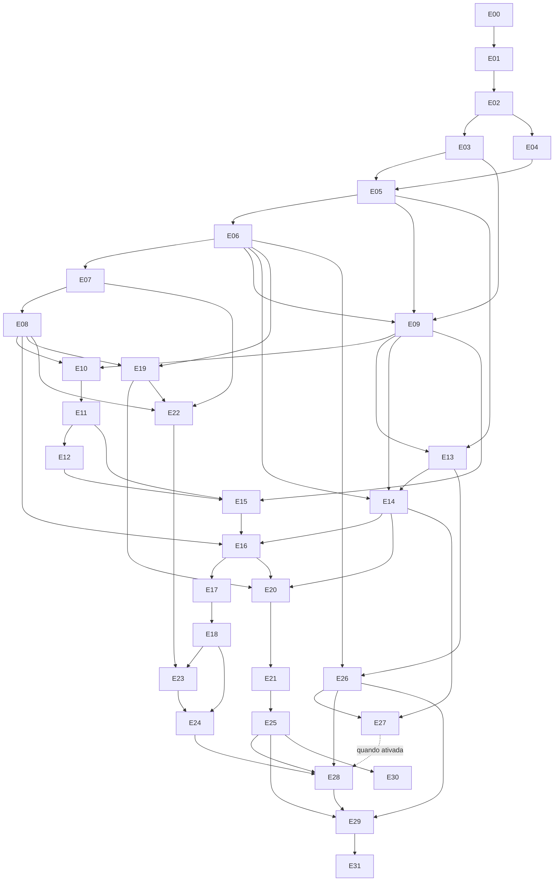

# Plano de implementação

## Estado e princípios

Planejamento, sem implementação do produto. E00 entregue; criação desta documentação não conclui contratos executáveis da E01. Quatro agentes trabalham depois dos contratos aprovados, por entregas verticais pequenas. Cada entrega inclui backend, frontend, banco, API, teste e aceite aplicáveis; ausência explícita não autoriza inventar escopo.

Instrução do usuário: não executar testes, lint, build ou comandos demorados sem confirmação. Comandos aqui são futuros; scripts só existirão após bootstrap/entrega correspondente.

## Convenções de caminhos

- Backend: `packages/backend/src/<módulo>`.
- Controllers: `apps/api/src/controllers/<recurso>`.
- Schema/migrations: `packages/database/src/schema`, `packages/database/migrations`.
- Frontend: `apps/web/src/features/<feature>` e rotas em `apps/web/src/app`.
- Processors: `apps/worker/src/processors/<feature>`.
- Cada módulo tem entradas públicas, contratos e testes focados; seguir padrão estabelecido no bootstrap.
- DoD global: [TEST_STRATEGY.md](TEST_STRATEGY.md).

## Fases e releases

| Fase | Entregas | Resultado |
|---|---|---|
| 0 — Arquitetura/contratos | E00–E01 | Documentação e contratos estáveis |
| 1 — Fundação | E02–E06 | Ambiente, UI, conta, quotas e observabilidade inicial |
| 2 — Acadêmico/documentos | E07–E12 | Disciplina, turma, materiais e parsing |
| 3 — IA/RAG | E13–E18 | BYOK, embeddings, tutor e artefatos |
| 4 — Professor | E19–E22 | Avaliações, versões e blueprint |
| 5 — Estudo/export | E23–E25 | Simulados/revisão, PDF/impressão |
| 6 — Comercial/plataforma | E26–E27 | Catálogo e IA plataforma validada |
| 7 — Segurança/release | E28–E29 | Privacidade consolidada, operação e recovery |
| 8 — Posteriores | E30–E31 | DOCX, PWA, modo escuro |

Segurança, métricas e entitlements entram cedo; E28/E29 consolidam prova e operação, não inauguram esses requisitos. Pagamentos automáticos, OCR e administração institucional são posteriores sem entrega detalhada de feature não validada.

## Entregas

### E00 — Planejamento mestre

- **Objetivo:** arquitetura, contratos descritivos, riscos, escopo e sequência.
- **Dependências:** requisitos originais.
- **Backend:** especificação, sem código.
- **Frontend:** UX e rotas propostas.
- **Banco:** modelo incremental, sem migrations.
- **API:** mapa descritivo de endpoints/DTOs/erros.
- **Arquivos:** documentos em docs.
- **Testes previstos:** revisão de cobertura/consistência; não testes de produto.
- **Aceite manual:** requisito possui decisão, entrega ou pendência explícita.
- **Pronto:** plano entregue, limites e bloqueios registrados.
- **Riscos:** hipótese tratada como validação concluída.
- **Não fazer:** implementação, instalação, migrations ou agentes de desenvolvimento.

### E01 — Contratos e decisões congelados

- **Objetivo:** converter plano em documentação versionada, schemas e contratos executáveis coerentes.
- **Dependências:** E00; validar decisões que bloqueiam implementação.
- **Backend:** entradas públicas e matriz de autorização.
- **Frontend:** mapa de rotas/fixtures DTO.
- **Banco:** modelo incremental, constraints, titular de cobrança e ownership de migrations.
- **API:** OpenAPI e schemas HTTP/jobs/errors/enums, required/nullable e limites.
- **Arquivos:** docs, `packages/contracts`, `packages/validation`, `docs/openapi.yaml`.
- **Testes previstos:** exemplos válidos/inválidos de DTO/schema e consistência OpenAPI.
- **Aceite manual:** agentes usam os mesmos exemplos; sem DTO ambíguo no primeiro pacote.
- **Pronto:** contratos aprovados, fonte única definida, bloqueios externos registrados.
- **Riscos:** validators duplicados/divergentes; mitigar com geração/fonte única.
- **Não fazer:** features de produto.

### E02 — Bootstrap do monorepo

- **Objetivo:** web/API/worker inicializam com config comum.
- **Dependências:** E01.
- **Backend:** composition roots mínimas, sem negócio.
- **Frontend:** Next.js inicial.
- **Banco:** package de conexão, sem tabelas de produto.
- **API:** health básico.
- **Arquivos:** manifests, workspace, tsconfigs, configs, `.env.example`, lockfile.
- **Testes previstos:** import boundaries e inicialização autorizada.
- **Aceite manual:** pnpm dev inicia os três processos.
- **Pronto:** versões fixadas, matriz de compatibilidade, scripts documentados.
- **Riscos:** incompatibilidade Node/framework/ORM; sem beta por padrão.
- **Não fazer:** CRUD/providers reais.

### E03 — Infra local e observabilidade inicial

- **Objetivo:** PostgreSQL/pgvector/Redis persistentes e conectividade verificável.
- **Dependências:** E02.
- **Backend:** DB lifecycle, logs JSON, request/correlation IDs.
- **Frontend:** estado técnico simples de indisponibilidade.
- **Banco:** migration CREATE EXTENSION vector, roles migrator/runtime.
- **API:** /health/live e /health/ready sem secrets.
- **Arquivos:** infra/compose.yaml, backend/platform, database.
- **Testes previstos:** conexão, extensão, reinício preservando volume.
- **Aceite manual:** dados sobrevivem a restart; readiness detecta dependência indisponível.
- **Pronto:** health checks, volumes e credenciais distintas documentados.
- **Riscos:** runtime superuser/BYPASSRLS.
- **Não fazer:** deploy cloud ou observabilidade extensa.

### E04 — Design system e shell responsivo

- **Objetivo:** base visual navegável das duas experiências.
- **Dependências:** E01, E02.
- **Backend:** nenhum novo domínio; fixtures aprovadas.
- **Frontend:** tokens, navegação, forms, estados e dashboards leves.
- **Banco:** nenhum.
- **API:** mocks conforme contratos, sem endpoints novos.
- **Arquivos:** web/styles, components, features/shell.
- **Testes previstos:** teclado/foco/contraste/viewports.
- **Aceite manual:** uso em 360 px/desktop sem perda de conteúdo.
- **Pronto:** componentes básicos/estados documentados; G0.
- **Riscos:** mocks esconderem limitações da API.
- **Não fazer:** dados reais/administração institucional.

### E05 — Conta, sessão e persona

- **Objetivo:** cadastro/login/logout/recovery e contexto inicial.
- **Dependências:** E03, E04.
- **Backend:** identity, workspace pessoal, Argon2id, guards/CSRF, tokens únicos.
- **Frontend:** auth/recovery/persona.
- **Banco:** users/sessions/account_tokens/workspaces/memberships/roles.
- **API:** /auth e /workspaces.
- **Arquivos:** identity, API auth, web auth, schema/migrations e mail adapter local.
- **Testes previstos:** cookie, revogação, CSRF, senha inválida, reset único e enumeração.
- **Aceite manual:** criar aluno/professor; sair; sessão antiga falha; reset revoga sessões.
- **Pronto:** identidade funcional e evidência para G1.
- **Riscos:** persona conceder autorização; email externo mal configurado.
- **Não fazer:** OAuth/MFA/admin público.

### E06 — Entitlements e quotas fundamentais

- **Objetivo:** capabilities e reservas atômicas, antes da IA/upload.
- **Dependências:** E05.
- **Backend:** billing/resolver/counters/reservations e reconciliação.
- **Frontend:** consumo próprio e limite/período.
- **Banco:** plans/entitlements/subscriptions mínimas/counters/events/reservations.
- **API:** /plans, /me/entitlements, /me/usage.
- **Arquivos:** billing, API plans/usage, web plan, database.
- **Testes previstos:** concorrência, duplicação, expiração e downgrade.
- **Aceite manual:** duas ações não ultrapassam último saldo; fake operação demonstrável.
- **Pronto:** enforcement server-side; G1 completo.
- **Riscos:** confirmar/refundar duas vezes; account_id sem FK concreta.
- **Não fazer:** checkout/desconto ativo.

### E07 — Disciplinas

- **Objetivo:** criar/organizar disciplinas próprias, tópicos e objetivos.
- **Dependências:** E05, E06.
- **Backend:** academic/courses, ownership e revisão concorrente.
- **Frontend:** lista/criação/edição/arquivamento.
- **Banco:** courses/course_topics com FKs de workspace.
- **API:** /courses conforme contrato.
- **Arquivos:** academic/courses, controllers courses, web courses, database.
- **Testes previstos:** owner, conflito revision e cross-workspace.
- **Aceite manual:** aluno cria disciplina pessoal; professor cria docente.
- **Pronto:** leitura/edição isoladas.
- **Riscos:** membership geral liberar curso docente indevidamente.
- **Não fazer:** turmas/grade institucional.

### E08 — Turmas, convites e matrículas

- **Objetivo:** professor cria turma, aluno ingressa no contexto permitido.
- **Dependências:** E07.
- **Backend:** academic/classes/enrollments/invitations, validade e uso atômico.
- **Frontend:** turma docente, convite, ingresso e saída.
- **Banco:** classes/enrollments/class_invitations.
- **API:** classes/invitations/enrollments.
- **Arquivos:** academic, controllers classes/enrollments, web classes, database.
- **Testes previstos:** validade, max uses concorrente, revogação e duas turmas.
- **Aceite manual:** convidado acessa turma, não outra; removido perde acesso.
- **Pronto:** G2 aprovado.
- **Riscos:** convite elevar papel para professor.
- **Não fazer:** sincronização institucional/importação de alunos.

### E09 — Jobs, outbox e worker

- **Objetivo:** operação assíncrona sobrevive a restart sem duplicar efeito.
- **Dependências:** E03, E05, E06.
- **Backend:** platform/jobs, dispatcher, reconciliação, retry/deadline.
- **Frontend:** polling/backoff com status real.
- **Banco:** jobs/outbox_events.
- **API:** GET /jobs/:id.
- **Arquivos:** platform/jobs, worker composition, controllers jobs, web job status.
- **Testes previstos:** commit sem enqueue, redelivery/restart e job alheio.
- **Aceite manual:** job demonstrativo retoma com único resultado persistido.
- **Pronto:** payload versionado, dedup, cleanup e erro seguro.
- **Riscos:** promessa exactly-once para serviço externo.
- **Não fazer:** Kafka/workflow engine/IA real.

### E10 — Materiais, storage e upload

- **Objetivo:** original privado e liberação por turma.
- **Dependências:** E08, E09.
- **Backend:** materials, StorageProvider/LocalStorageProvider, quotas e compensação.
- **Frontend:** material/upload/private/release/status.
- **Banco:** materials/releases/documents.
- **API:** materiais/upload/content/delete.
- **Arquivos:** materials, platform/storage, controllers, web materials, database.
- **Testes previstos:** tamanho/MIME/traversal/quota, falha DB/storage e acesso alheio.
- **Aceite manual:** original baixado idêntico; aluno só recebe release válido.
- **Pronto:** original preservado; storage privado; órfãos reconciliáveis.
- **Riscos:** diretório público ou nome de usuário virar path.
- **Não fazer:** S3/OCR/parsing completo.

### E11 — Processamento PDF

- **Objetivo:** extrair página/texto de PDF digital.
- **Dependências:** E10.
- **Backend:** documents/parsers/pdf e processor isolado/limitado.
- **Frontend:** etapas/falhas e PDF sem texto.
- **Banco:** versions/pages/chunks e etapa de extração.
- **API:** estado/reprocessamento existentes.
- **Arquivos:** documents PDF, processor documents, web document status, database.
- **Testes previstos:** Unicode, vazio, protegido, corrompido, fórmula e timeout.
- **Aceite manual:** fixture mostra página/texto; falha mantém original.
- **Pronto:** parsing versionado/repetível, limitações documentadas.
- **Riscos:** ordem/fórmulas incorretas.
- **Não fazer:** OCR/fidelidade visual perfeita.

### E12 — Processamento PPTX

- **Objetivo:** estudar slides sem conversão manual.
- **Dependências:** E11.
- **Backend:** adapter OOXML, limites ZIP/XML.
- **Frontend:** números de slide/notas e conteúdo não extraído.
- **Banco:** mesmo modelo pages, parser_version.
- **API:** upload existente aceita PPTX validado.
- **Arquivos:** documents PPTX, processor e fixtures.
- **Testes previstos:** ordem/notas, XML inválido, ZIP bomb e imagem sem texto.
- **Aceite manual:** fixture preserva numeração/textos.
- **Pronto:** G3 aprovado.
- **Riscos:** layout/objetos não extraíveis.
- **Não fazer:** PPT/ODP ou conteúdo ativo.

### E13 — Vault e conexão BYOK

- **Objetivo:** salvar/substituir/remover key com segurança.
- **Dependências:** E05, E09.
- **Backend:** ai/credentials, AES-GCM/AAD/key_version/mask.
- **Frontend:** IA settings, campo write-only e status.
- **Banco:** ai_connections/ai_preferences.
- **API:** PUT/DELETE connection/check fake inicial.
- **Arquivos:** ai/credentials, controllers ai, web settings, database.
- **Testes previstos:** round-trip/tamper/rotação/logs/leitura alheia.
- **Aceite manual:** chave não reaparece; delete impede uso.
- **Pronto:** DB/log/DTO sem plaintext.
- **Riscos:** master key perdida ou body exposto.
- **Não fazer:** pooling/desconto.

### E14 — AI Gateway e Ollama Cloud

- **Objetivo:** primeira geração real BYOK server-side.
- **Dependências:** E06, E09, E13.
- **Backend:** resolver/provider HTTP/fake/usage, timeout/retry.
- **Frontend:** modelos elegíveis/check/erros claros.
- **Banco:** ai_usage_events e configuração necessária.
- **API:** models/preferences/operação demonstrativa controlada.
- **Arquivos:** ai, processors AI, controllers ai, web settings, database.
- **Testes previstos:** 401/429/timeout/JSON inválido/tokens ausentes/key removida.
- **Aceite manual:** geração com key própria e usage próprio; chamada real autorizada.
- **Pronto:** G4; real integration separada de suíte determinística.
- **Riscos:** presumir structured output cloud ou capacidade ilimitada.
- **Não fazer:** IA paga pela plataforma/fallback cruzado.

### E15 — Chunking, embeddings e versões

- **Objetivo:** índice consistente e reprocessamento seguro.
- **Dependências:** E11, E12, E09.
- **Backend:** chunker/tokenizer/adapter CPU, fingerprint e normalização.
- **Frontend:** indexação/reprocessamento.
- **Banco:** vector(384), fingerprint, active_version e índices de filtros.
- **API:** estado/reprocessamento existente.
- **Arquivos:** documents chunking, ai embeddings, processors, database.
- **Testes previstos:** tokens/dimensão/pooling/restart/ativação atômica.
- **Aceite manual:** READY; falha nova mantém versão válida anterior.
- **Pronto:** benchmark CPU/RAM e corpus português registrados.
- **Riscos:** truncamento silencioso ou hardware insuficiente.
- **Não fazer:** modelos simultâneos/HNSW prematuro.

### E16 — RAG autorizado e citações

- **Objetivo:** pergunta documental com resposta rastreável e isolamento.
- **Dependências:** E08, E14, E15.
- **Backend:** rag SQL/RLS/context builder/citations.
- **Frontend:** pergunta pontual/referências/fonte indisponível.
- **Banco:** policies e relações mínimas de proveniência.
- **API:** fluxo mínimo conversation/message assíncrono.
- **Arquivos:** rag, interfaces study, controllers, web document chat, database.
- **Testes previstos:** tenants/turmas/segredo/revogação/injection, contexto capturado.
- **Aceite manual:** cita página; fake provider só recebe chunks elegíveis.
- **Pronto:** prova de isolamento; conclusão de G5 após E17.
- **Riscos:** filtrar top-k global após retrieval.
- **Não fazer:** reranker externo/busca global.

### E17 — Tutor e histórico limitado

- **Objetivo:** conversa persistente com janela e contexto controlados.
- **Dependências:** E16.
- **Backend:** study/conversations, paginação, sumarização e invalidação.
- **Frontend:** geral/documento/disciplina/revisão/tutor.
- **Banco:** conversations/contexts/messages/citations/summaries.
- **API:** criar/paginar/postar mensagens.
- **Arquivos:** study, ai prompts tutor/summary, processors, web chat, database.
- **Testes previstos:** clientMessageId, orçamento, restart e fonte revogada.
- **Aceite manual:** retomar conversa longa sem histórico integral no prompt.
- **Pronto:** G5; summaries herdam dependências.
- **Riscos:** resumo manter dado revogado.
- **Não fazer:** memória global entre usuários/tooling autônomo.

### E18 — Resumos e explicações

- **Objetivo:** artefatos de estudo persistentes com fontes.
- **Dependências:** E17.
- **Backend:** schemas resumo/explicação e cobertura ampla.
- **Frontend:** criar/job/ler/acessar fontes.
- **Banco:** study_artifacts/sources.
- **API:** /study/artifacts.
- **Arquivos:** study, validation/ai, prompts, processors, web artifacts, database.
- **Testes previstos:** inválido/cobertura/fonte alheia/quota.
- **Aceite manual:** resumo inclui materiais selecionados e proveniência.
- **Pronto:** payload versionado/autorizações/falhas claros.
- **Riscos:** top-k omitir conteúdo silenciosamente.
- **Não fazer:** flashcards/plano/export de estudo.

### E19 — Avaliação manual

- **Objetivo:** professor monta prova/trabalho/lista sem IA.
- **Dependências:** E08, E06.
- **Backend:** assessments/questions/answers/state machine.
- **Frontend:** editor, reorder acessível, dificuldade, pontos e revisão.
- **Banco:** assessments/questions/answers.
- **API:** criar/editar/conjunto ordenado/transições.
- **Arquivos:** assessments, controllers, web assessments, database.
- **Testes previstos:** excluir/ordem/pontos/revision/estados/403 ou 404 adequado.
- **Aceite manual:** professor monta prova; aluno não acessa detalhe/gabarito.
- **Pronto:** editor completo e isolamento demonstrado.
- **Riscos:** answer DTO reutilizado em Study.
- **Não fazer:** geração/aplicação online ao aluno.

### E20 — Geração de avaliações

- **Objetivo:** conjunto solicitado vira DRAFT revisável.
- **Dependências:** E14, E16, E19.
- **Backend:** structured generation, cobertura, semantic validation, commit atômico.
- **Frontend:** materiais/total/tipos/dificuldade/instruções/job.
- **Banco:** generations/sources e resultado privado.
- **API:** /assessments/:id/generations.
- **Arquivos:** assessments orchestration, ai prompts/schema, processors, web generation.
- **Testes previstos:** 6 objetivas/4 discursivas, parcial/inválido/repair/retry.
- **Aceite manual:** dez válidas em DRAFT; inválido não cria prova.
- **Pronto:** G6 após E21; proveniência/usage completos.
- **Riscos:** conteúdo incorreto apesar de estrutura válida.
- **Não fazer:** aprovação automática/enviar aluno.

### E21 — Duplicação e versões

- **Objetivo:** variantes com origem e gabarito corretos.
- **Dependências:** E20.
- **Backend:** family/copy/remapeamento de IDs e alternativas.
- **Frontend:** copiar/nomear/conferir variante.
- **Banco:** family_id/copied_from_id/variant_label.
- **API:** /assessments/:id/copies.
- **Arquivos:** assessments copies, controllers, web variants, database.
- **Testes previstos:** reorder alternativas/gabarito, pontos, independência.
- **Aceite manual:** editar cópia não muda original.
- **Pronto:** G6; variantes prontas para export autorizado.
- **Riscos:** resposta ficar presa a índice antigo.
- **Não fazer:** equivalência psicométrica/variantes ilimitadas.

### E22 — StudyBlueprint

- **Objetivo:** orientação pública igual para elegíveis da turma.
- **Dependências:** E08, E07, E19.
- **Backend:** schema independente/publicação/audit.
- **Frontend:** seleção de tópicos públicos e leitura estudantil.
- **Banco:** blueprints/topics.
- **API:** edição/publicação/leitura por turma.
- **Arquivos:** academic/study blueprint, controllers, web blueprint, database.
- **Testes previstos:** campos proibidos/elegibilidade/mesma revisão.
- **Aceite manual:** dois alunos recebem mesma versão, sem detalhe de prova.
- **Pronto:** G7 aprovado.
- **Riscos:** free text reconstruir questão; usar catálogo público controlado.
- **Não fazer:** derivar automaticamente de Assessment privado.

### E23 — Simulados e dificuldades

- **Objetivo:** simulado estudantil independente, correção e revisão por tópico.
- **Dependências:** E18, E22.
- **Backend:** geração/tentativa/submission/correção objetiva.
- **Frontend:** responder/enviar/revisar erros.
- **Banco:** practice tests/questions/answers/attempts.
- **API:** artifact generation, attempt/submission.
- **Arquivos:** study practice, ai schema/prompts, processors, web practice, database.
- **Testes previstos:** gabarito oculto antes de enviar, repetição/isolamento.
- **Aceite manual:** erros por tópico recomendam revisão com fontes.
- **Pronto:** resultado persistido, submission idempotente.
- **Riscos:** feedback discursivo IA parecer nota definitiva.
- **Não fazer:** reutilizar questões privadas docentes.

### E24 — Flashcards, planos e revisão

- **Objetivo:** completar estudo com materiais/erros e tempo disponível.
- **Dependências:** E18, E23.
- **Backend:** schemas flashcards/plano/revisão/exercícios semelhantes.
- **Frontend:** cards, plano, revisão de questão e exercícios.
- **Banco:** novos kinds em study_artifacts; sem domínio duplicado.
- **API:** recurso artifact com schemas por tipo.
- **Arquivos:** study, ai templates/schemas, processors, web artifacts.
- **Testes previstos:** datas/tempo/schema/fontes/conteúdo permitido.
- **Aceite manual:** aluno cria plano/flashcards/revisão de seus erros.
- **Pronto:** G8 completo.
- **Riscos:** recomendação sem evidência.
- **Não fazer:** spaced repetition sofisticado/diagnóstico educacional.

### E25 — PDF e impressão

- **Objetivo:** exportar avaliação e gabarito separadamente.
- **Dependências:** E21.
- **Backend:** exports/snapshot imutável/renderer isolado sem rede.
- **Frontend:** opções/job/download/impressão.
- **Banco:** exports revision/variant/TTL/status.
- **API:** criar export/download privado.
- **Arquivos:** exports, processors exports, controllers, web exports, database.
- **Testes previstos:** prova sem gabarito, paginação/acentos/matemática/acesso.
- **Aceite manual:** PDFs imprimíveis; aluno/outro usuário não baixa.
- **Pronto:** G9 e revisão visual aprovados.
- **Riscos:** fórmula cortada/renderer acessar rede.
- **Não fazer:** HTML arbitrário/DOCX.

### E26 — Catálogo comercial e descontos

- **Objetivo:** configurar quatro planos sem acoplar features a nomes.
- **Dependências:** E06, E13.
- **Backend:** preços versionados/transições/regras de desconto.
- **Frontend:** catálogo/limites/plano atual.
- **Banco:** prices/discounts; invoices só com cobrança efetiva.
- **API:** catálogo/visão própria, sem checkout fictício.
- **Arquivos:** billing, controllers, web plans, database.
- **Testes previstos:** stack/cap/regra inválida/período/downgrade.
- **Aceite manual:** mudar config muda direitos sem editar cada feature.
- **Pronto:** descontos inativos até elegibilidade contratual/técnica validada.
- **Riscos:** anunciar contratação paga sem meio de cobrança.
- **Não fazer:** pooling/gateway não escolhido.

### E27 — IA da plataforma

- **Objetivo:** elegível usa geração sem cadastrar key pessoal.
- **Dependências:** E14, E26; contrato/fornecedor/orçamento formalmente validados.
- **Backend:** PlatformAIProvider, credential própria, payer/budget.
- **Frontend:** modo explícito e quota correspondente.
- **Banco:** payer_scope/preços/configuração.
- **API:** preferences existentes, sem key ao client.
- **Arquivos:** ai platform adapter, billing integration, web settings, database.
- **Testes previstos:** Free bloqueado/Premium permitido/BYOK preservado.
- **Aceite manual:** gerar sem conexão pessoal; custo plataforma registrado.
- **Pronto:** G10, sem bloqueio externo pendente.
- **Riscos:** revenda não autorizada/margem negativa.
- **Não fazer:** ativar sem validações; key de usuário como fallback.

### E28 — Privacidade, auditoria e revisão de segurança

- **Objetivo:** export/exclusão de dados e prova consolidada de isolamento.
- **Dependências:** fluxos E17–E26 completos; E27 quando ativada, ou explicitamente desativada.
- **Backend:** privacy requests/purge/reautenticação/audit/invalidation.
- **Frontend:** solicitar/exportar/excluir/acompanhar.
- **Banco:** privacy_requests/retention e dependências das fontes.
- **API:** /me/privacy-requests.
- **Arquivos:** identity privacy/audit/platform cleanup, controllers, web privacy, tests.
- **Testes previstos:** purge completo/jobs ativos/histórico revogado/secrets.
- **Aceite manual:** export próprio; exclusão bloqueia e remove derivados.
- **Pronto:** G11 sem falha crítica conhecida.
- **Riscos:** restore ressuscitar dado excluído.
- **Não fazer:** alegar certificação jurídica automática.

### E29 — Release, operação e recuperação

- **Objetivo:** piloto em servidor único recuperável.
- **Dependências:** E25, E26, E28; E27 conforme status de ativação.
- **Backend:** readiness/shutdown/queue/AI metrics/reconciliação.
- **Frontend:** sessão/provider offline, acessibilidade final.
- **Banco:** backup/restore/migration deploy.
- **API:** health mínimo público, metrics restritas.
- **Arquivos:** Dockerfiles/CI/deploy/rollback/runbook/tests.
- **Testes previstos:** smoke/restart/restore/worker interrompido/orçamento.
- **Aceite manual:** restaurar DB + originais em ambiente separado.
- **Pronto:** G12 + DoD global; recursos bloqueados desativados.
- **Riscos:** backup existir sem restaurar.
- **Não fazer:** Kubernetes/expansão de features.

### E30 — DOCX

- **Objetivo:** export editável posterior ao primeiro release.
- **Dependências:** E25; capability e compatibilidade do formato autorizadas.
- **Backend:** adapter DOCX e matemática.
- **Frontend:** formato adicional.
- **Banco:** formato/status existentes; nenhuma entidade nova.
- **API:** recurso export existente.
- **Arquivos:** exports DOCX, web export selection, fixtures.
- **Testes previstos:** abrir editores-alvo, ordem/acentos/respostas separadas.
- **Aceite manual:** arquivo editável preserva conteúdo.
- **Pronto:** inspeção visual e compatibilidade documentadas.
- **Riscos:** fórmulas/layout diferentes.
- **Não fazer:** prometer fidelidade idêntica ao PDF.

### E31 — PWA e modo escuro

- **Objetivo:** instalação/conforto após fluxos estabilizados.
- **Dependências:** E29.
- **Backend:** sessão/cache policy revisados.
- **Frontend:** manifest/service worker restrito/tokens escuros.
- **Banco:** nenhum domínio novo.
- **API:** nenhuma feature nova; cache privado revisado.
- **Arquivos:** web manifest/SW/styles, privacy/cache tests.
- **Testes previstos:** install/logout/update/offline/contraste.
- **Aceite manual:** shell instala; conteúdo privado não fica em cache indevido.
- **Pronto:** estratégia offline sem dado sensível.
- **Riscos:** prova/key/histórico persistirem no dispositivo.
- **Não fazer:** chat offline/app nativo.

## Dependency graph

Dependências de cada entrega acima são normativas. Diagrama resume caminhos; E28 só depende de E27 se o recurso for ativado.



## Paralelismo

| Janela | Trabalho permitido |
|---|---|
| Após E02 | E03 infra e E04 UI |
| Após E05/E06 | E07 acadêmico, E09 jobs; E13 depois de E09 |
| Após E10 | E11 parser e E14 gateway se suas dependências prontas |
| Após E08/E06 | E19 manual enquanto documentos/IA avançam |
| Após E16/E19 | E17 tutor e E20 geração |
| Após E20 | E21 versões e E22 blueprint se predecessors completos |
| Após E18/E22 | E23 simulado e E25 export se E21 completo |
| Após E23 | E24 estudo e comercial E26/E27 conforme dependências |
| Final | E28/E29; E30/E31 fora do primeiro release |

Quatro agentes não significam quatro entregas independentes a toda hora. Contratos/migrations deliberadamente serializados. [SUBAGENT_PLAN.md](SUBAGENT_PLAN.md).

## Integration Gates

Comandos propostos; scripts criados no bootstrap/entrega correspondente e executados somente com autorização necessária.

| Gate | Entregas | Comandos/checks previstos | Aceite manual |
|---|---|---|---|
| G0 Contratos | E01–E04 | pnpm contracts:check; pnpm typecheck | Apps/fixtures/OpenAPI concordam |
| G1 Identidade | E05–E06 | test:integration identity; test:e2e auth | Cadastro/persona/login/logout/reset e quota concorrente |
| G2 Acadêmico | E07–E08 | integration academic; E2E course/class | Usuários/turmas isolados |
| G3 Documentos | E09–E12 | pnpm test:documents; E2E upload | PDF/PPTX, original preservado, falha recuperável |
| G4 BYOK | E13–E14 | test:ai; test:security credentials | Key mascarada/rotate/delete e geração própria |
| G5 RAG | E15–E17 | test:rag; security leakage; E2E chat | Fonte/página e contexto sem prova privada |
| G6 Avaliação | E19–E21 | integration assessment; AI schema; E2E teacher | 6 objetivas/4 discursivas, editar/copiar/aluno bloqueado |
| G7 Blueprint | E22 | security blueprint; E2E class blueprint | Mesma revisão para elegíveis, sem segredo |
| G8 Estudo | E18/E23/E24 | E2E practice/study; AI fixtures | Simulado/erros/flashcards/plano |
| G9 Export | E25 | test:exports; E2E export | PDF sem answers, answer key separado |
| G10 Comercial/IA | E26/E27 | billing concurrency; provider resolution | Direitos via config, IA platform elegível |
| G11 Segurança/privacidade | E28 | test:security; privacy integration | Delete/revoke e logs sem secrets |
| G12 Release | E29 | lint/typecheck/test:release/build | Deploy/restart/restore/smoke |

Exemplos de comandos:

```bash
pnpm test:integration -- --grep identity
pnpm test:e2e -- --grep auth
pnpm test:security -- --grep credentials
```

G10 com E27 bloqueada aprova somente catálogo/BYOK; release registra ausência de IA plataforma. Gate de leakage obrigatório: marcador único em prova/gabarito/prompt, tentativas via API/job/download/RAG/chat/histórico e assert também no contexto do fake provider.

## Riscos técnicos

| Risco | Impacto | Mitigação |
|---|---|---|
| Prova vazar em RAG/histórico/export | Crítico | Fronteiras/RLS/DTO e teste do contexto |
| Contrato BYOK/cloud inadequado | Alto | Validação antes de produção |
| Cloud sem structured output nativo | Alto | Texto validado/repair limitado/falha segura |
| Embeddings cloud presumidos | Alto | Adapter CPU independente |
| Modelos/limites mudarem | Alto | Catálogo/capability/integration real periódico |
| Matemática PDF | Alto | Corpus/revisão/limitações |
| CPU/RAM embedding | Médio/alto | Benchmark/concorrência/adapter |
| Overspend quota | Alto | Reserva transacional/reconciliação |
| Retry cobrar duas vezes | Alto | Attempts/budget/unknown cost |
| DB/storage inconsistentes | Alto | Compensação/reconciliação |
| Runtime contornar RLS | Crítico | Roles/testes runtime reais |
| Revogação não invalidar summaries | Alto | Dependências/invalidação conservadora |
| Blueprint reconstruir prova | Alto | Tópicos públicos controlados |
| Margem IA negativa | Alto | Custo por operação/usuário e quota |
| Migrations concorrentes | Médio | Owner B e integração serial |
| Dependência/licença inadequada | Alto | Versões/revisão bootstrap/release |
| Restore reviver excluído | Alto | Reaplicar exclusões |
| Cache PWA privado | Alto | Shell restrito/sem dados offline |

## Próxima ação

E01: revisar documentação criada, concretizar OpenAPI/schemas e resolver pendências que bloqueiam implementação/providers. Depois E02–E04 estabelecem ambiente/UI. Paralelismo só com contratos estáveis e tarefas específicas.
