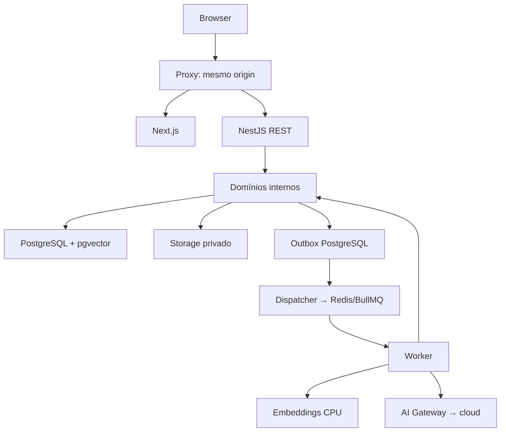
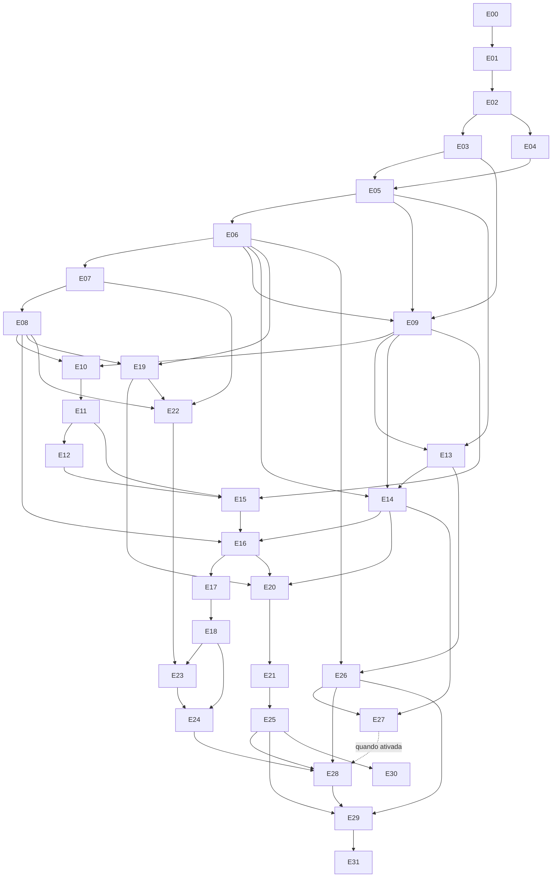

# Planejamento Mestre — Facilita Estudo

Documento consolidado dos arquivos temáticos em docs. Data: 02/10/2026. Status: planejamento; produto não implementado.

## A. Entendimento do produto

Facilita Estudo será uma plataforma acadêmica web para professores e alunos, com organização de materiais, estudo assistido por IA e preparação de avaliações.

Monólito modular, com frontend, API e worker separados como processos. Regras de negócio compartilhadas entre API e worker. Segurança central: avaliações privadas, respostas, prompts e derivados nunca alimentam os fluxos do aluno.

Lançamento proposto: conta, disciplinas/turmas, PDF/PPTX, RAG/tutor/resumos, avaliações manuais e geradas, versões, StudyBlueprint, simulados, flashcards/plano/revisão, PDF/impressão, BYOK, quotas e métricas. IA da plataforma condicionada a validação contratual/financeira.

Posteriores: DOCX, PWA, administração institucional, pagamentos automáticos, OCR e analytics avançado.

Workspace original inspecionado em 02/10/2026: vazio, sem Git ou código. Esta etapa cria somente documentação; nenhum teste/lint/build, instalação ou subagente de desenvolvimento executado.

FATO VERIFICADO = fonte oficial consultada em 02/10/2026; DECISÃO NOSSA = proposta arquitetural; HIPÓTESE = exige medição; VALIDAÇÃO NECESSÁRIA = pendência explícita. Revalidar fatos externos antes da integração.

Documentos temáticos e requisitos originais estão no [índice](README.md).

## B. Pontos que precisam de decisão

### Contexto e estado

Produto web acadêmico para professores e alunos, com materiais, estudo por IA e avaliações privadas. Stack preferencial Next.js/NestJS/PostgreSQL; monólito modular, infraestrutura controlada e quatro agentes no desenvolvimento posterior.

Decisões abaixo são propostas do planejamento. Não significam implementação ou validação comercial concluída. Fontes externas foram consultadas em 02/10/2026.

### ADRs

| ADR | Problema | Opções | Decisão | Justificativa | Consequências |
|---|---|---|---|---|---|
| 001 | Organizar produto sem infraestrutura excessiva | Aplicação sem fronteiras; monólito modular; microserviços | Monólito modular | Fronteiras claras, deploy simples e transações locais | API e worker compartilham módulos internos |
| 002 | Gerenciar monorepo | pnpm; pnpm + Turborepo; Nx | pnpm workspaces inicialmente | Três aplicações não exigem orquestrador adicional | Adicionar Turborepo somente com benefício medido de cache/execução incremental |
| 003 | Persistência tipada com recursos PostgreSQL | Prisma; Drizzle; TypeORM | Drizzle + pg | Adequação a SQL explícito, pgvector e políticas de banco | SQL das migrations revisado; equipe precisa dominar PostgreSQL |
| 004 | Autenticação web | JWT/refresh; sessão opaca; fornecedor externo | Sessão opaca em cookie | Revogação simples, menor complexidade | Consulta de sessão; JWT dispensável no início |
| 005 | Múltiplos papéis | users.role; papéis globais; contextuais | Papéis por workspace e turma | Usuário pode ensinar e estudar em contextos distintos | Persona de UI não concede autorização |
| 006 | Reusar domínio em API/worker | Importar API; duplicar serviços; pacote interno | packages/backend exclusivo de API/worker | Reuso explícito sem dependência entre aplicações | Frontend proibido de importar módulos internos |
| 007 | Entrega confiável de jobs | Enqueue direto; transação distribuída; outbox | Outbox PostgreSQL + BullMQ | Evita perda entre commit e Redis | Dispatcher, reconciliação e idempotência |
| 008 | Preservar originais e permitir S3 | Filesystem direto; abstração; BYTEA | StorageProvider, filesystem inicial | Regras independentes do storage | Banco guarda referências; compensação entre storage e DB |
| 009 | Embeddings independentes de BYOK | Presumir cloud; fornecedor externo; CPU interno | E5 multilíngue no worker, via adapter | Índice não depende de chave pessoal ou Ollama local | Medir CPU, RAM e qualidade |
| 010 | Recuperar apenas conteúdo autorizado | Filtrar depois; SQL autorizado; instruir modelo | SQL autorizado + RLS | Conteúdo proibido não chega ao modelo | Aplicar também a histórico, jobs, fontes e exports |
| 011 | Conectar professor e estudo | Sanitizar prova automaticamente; blueprint separado | Blueprint de tópicos já publicáveis | Evita derivar conteúdo público de questões secretas | Publicação explícita pelo professor |
| 012 | JSON com Ollama Cloud | Presumir schema nativo; validar texto; bloquear tudo | Texto → parse → schema → validação semântica | Não inventa capacidade cloud | Saída inválida falha sem criar avaliação |
| 013 | Publicar avaliação | Liberar diretamente ao aluno; finalizar documento | PUBLISHED continua privado | Aplicação online de prova real não foi especificada | Liberação exige requisito futuro separado |
| 014 | Regras comerciais | Condicionais por plano; serviço central | Capabilities + limites versionados | Evita acoplamento comercial | Entitlement não concede papel pedagógico |
| 015 | Primeira exportação | PDF; DOCX; ambos | PDF + impressão | Menor escopo e validação visual | DOCX posterior |
| 016 | IA da plataforma | Chaves dos usuários; conta própria; fornecedor separado | Credencial própria da plataforma | Isolamento e responsabilidade financeira | Fornecedor e contrato pendentes |

### Comparação de ORM

Avaliação técnica para este produto, não ranking universal:

| Critério | Prisma | Drizzle | TypeORM |
|---|---|---|---|
| Tipagem | Cliente gerado | Schema TypeScript, SQL explícito | Entidades/repositories |
| Produtividade CRUD | Alta | Alta, maior proximidade do SQL | Alta para equipes acostumadas ao padrão |
| Migrations | Fluxo próprio | SQL gerado/customizado, revisável | Migrations disponíveis |
| PostgreSQL específico | Pode exigir SQL customizado | Bom encaixe com operações explícitas | Possível, com escape SQL |
| pgvector | Validar versão e tipos | Guia específico para vetores/índices | Validar integração na versão escolhida |
| Escolha | Alternativa forte | Recomendada | Menor benefício no contexto atual |

FATO VERIFICADO: Drizzle documenta vetores, índices, extension via migration customizada e geração/aplicação de migrations SQL. [pgvector](https://orm.drizzle.team/docs/guides/vector-similarity-search), [migrations](https://orm.drizzle.team/docs/migrations).

Regra: revisar migrations geradas; nunca sincronizar schema automaticamente em produção. Revisar constraints, RLS, índices e impacto operacional. Fixar versões na E02; não instalar dependências nesta etapa documental.

### Pendências e bloqueios

| Pendência | Proposta inicial | Bloqueia |
|---|---|---|
| Idade/público | Acadêmico adulto | Cloud por menores |
| Formatos | PDF/PPTX | PPT, ODP e outros |
| Digitalizados | Preservar original, erro explicativo | OCR |
| Publicação de prova | Finalização privada | Aplicação online de avaliação real |
| Cobrança | Catálogo/entitlements e concessão controlada em piloto | Venda pública sem gateway |
| IA da plataforma | Adapter e credencial próprios | Ativação comercial |
| Embeddings CPU | E5 multilíngue pequeno | SLA definitivo |
| Preços/limites/descontos | Configuração versionada | Oferta final |
| Retenção | Por categoria | Produção |
| Instituições | Contexto preparado | Administração institucional completa |
| Qualidade matemática | Corpus técnico e revisão humana | Promessa de fidelidade de parsing/export |
| Operação | Servidor único, backup/restore | SLO, RPO e RTO finais |

VALIDAÇÃO NECESSÁRIA: termos para custódia BYOK, integração SaaS, fornecedor da plataforma, transferências internacionais, licenças de modelos/pesos, retenção, gateway, preços e critérios de piloto.

FATO VERIFICADO: termos Ollama consultados exigem idade mínima de 18 anos. A documentação da API não constitui autorização contratual para uso comercial específico ou compartilhamento de credenciais. [Termos](https://ollama.com/terms).

### Regras de mudança

1. Registrar problema, opções, decisão, justificativa e consequências.
2. Atualizar contrato e entregas afetadas antes da implementação.
3. Não alterar requisito silenciosamente.
4. Não permitir pooling, empréstimo ou uso cruzado de chaves sem autorização formal aplicável; planejamento atual implementa somente BYOK individual.
5. Não adicionar microserviços, GraphQL, Kafka, Kubernetes, service mesh, event sourcing ou CQRS completo sem necessidade concreta.

## C. Arquitetura proposta

### Resumo executivo

Facilita Estudo centraliza disciplinas, turmas, materiais e estudo acadêmico por IA, com experiência docente para criação/revisão/exportação de avaliações e experiência estudantil para tutor, resumos, flashcards, simulados e revisão.

Prioridade estrutural: avaliações reais, gabaritos, prompts e derivados privados nunca chegam aos fluxos do aluno. Monólito modular com três processos; nenhum microserviço no MVP.

Workspace inspecionado em 02/10/2026: vazio, sem Git, tecnologias existentes ou dívida técnica identificável. Documentação não implica bootstrap executado.

### Escopo

Lançamento proposto: autenticação, disciplinas, turmas, PDF/PPTX, RAG, tutor, resumos, avaliações manuais/geradas, versões, StudyBlueprint, simulados, flashcards/plano/revisão, PDF/impressão, BYOK, quotas e observabilidade. IA da plataforma depende de validação contratual/financeira.

Posteriores: DOCX, PWA, administração institucional, pagamento automático, OCR e analytics avançado. Requisitos permanecem no roadmap, sem remoção silenciosa.

### Stack

| Camada | Escolha proposta |
|---|---|
| Web | Next.js App Router, React, TypeScript |
| UI | Tailwind CSS, shadcn/ui |
| API | NestJS, REST, TypeScript |
| Runtime | Node.js LTS compatível com frameworks |
| Banco | PostgreSQL self-hosted + pgvector |
| Persistência | Drizzle ORM + pg |
| Jobs | Redis + BullMQ |
| Storage | Filesystem privado via StorageProvider |
| Validação | Zod para contratos e respostas de IA |
| Auth | Sessão opaca, cookie HttpOnly, Argon2id |
| IA generativa BYOK | Ollama Cloud, HTTP server-side |
| Embeddings | Transformers.js/E5 no worker, adapter CPU |
| PDF | Adapter PDF.js; confirmar qualidade em spike |
| Slides | Adapter OOXML, ZIP/XML limitado |
| Export | HTML controlado → Chromium/PDF no worker |
| Testes | Vitest, integração HTTP/DB, Playwright |
| Observabilidade | Logs JSON, IDs, métricas e health |
| Monorepo | pnpm workspaces |
| Infra | Docker Compose |

Versões exatas/lockfile/matriz de compatibilidade: E02. Não usar beta por padrão. Comparação dos ORMs e alternativas de monorepo em [DECISIONS.md](DECISIONS.md).

FATO VERIFICADO: pnpm suporta monorepos via workspaces. DECISÃO NOSSA: não adicionar Turborepo/Nx inicialmente; reconsiderar por benefício medido. [pnpm](https://pnpm.io/workspaces).

### Topologia



Banco, storage, filas e IA são dependências laterais; não uma cadeia obrigatória sequencial.

### Responsabilidades

- Web: navegação, forms, estados de jobs, apresentação e acessibilidade.
- API: autenticação/autorização, DTOs, regras, transações e criação de jobs.
- Worker: parsing, embeddings, geração, resumo, exportação, limpeza e reconciliação.
- PostgreSQL: fonte de verdade de dados, jobs, quotas, auditoria e outbox.
- Redis: transporte/execução; não saldo comercial ou única cópia de job.
- Storage: arquivos originais e artefatos privados.
- Gateway: única entrada para chamadas generativas externas.

### Estrutura proposta

```text
apps/
  web/src/{app,features,components,lib,styles}/
  api/src/{controllers,http,composition}/
  api/src/main.ts
  worker/src/{processors,composition}/
  worker/src/main.ts
packages/
  backend/src/{identity,academic,materials,documents,assessments,study}/
  backend/src/{ai,rag,billing,exports,audit,platform}/
  database/src/{schema,repositories}/
  database/migrations/
  contracts/src/{http,jobs,errors,enums}/
  validation/src/ai/
  config/
  eslint-config/
  typescript-config/
infra/
  compose.yaml
  docker/
  scripts/
tests/
  integration/
  e2e/
  fixtures/
  evaluations/
docs/
.env.example
pnpm-workspace.yaml
package.json
pnpm-lock.yaml
```

`contracts` substitui `shared-types`: somente DTOs públicos e payloads técnicos. `backend` é pacote interno server-only, sem dependência entre apps.

### Fronteiras

- Web importa contracts; não backend/database/vault/providers.
- API/worker importam módulos por entradas públicas.
- Domínios não importam controllers/apps.
- SDKs ficam em adapters.
- Consultas entre domínios usam interfaces públicas.
- DTO não retorna entidade ORM diretamente.
- Configuração pública e server-only separadas.
- Evitar repository genérico e abstrações sem benefício concreto.

### Requisição síncrona

```text
requestId → sessão → CSRF (se mutável) → validação DTO
→ escopo/papel/ownership → entitlement → serviço de domínio
→ transação PostgreSQL → DTO explícito → resposta
```

### Operação assíncrona

```text
autorização → reserva de quota → Job + Outbox em transação
→ 202 → dispatcher BullMQ → worker reautoriza
→ execução/usage → resultado validado → commit idempotente
→ confirmação/liberação de quota → polling autorizado
```

Fila é ao menos uma vez; efeito de domínio deve ser idempotente. Não prometer exactly-once para chamadas externas ou cobrança do fornecedor.

FATO VERIFICADO: BullMQ orienta jobs simples/idempotentes para retries. DECISÃO NOSSA: outbox e reconciliação resolvem a fronteira DB/fila. [BullMQ](https://docs.bullmq.io/patterns/idempotent-jobs).

### Ambiente local

Portas: web 3000, API 3001, PostgreSQL 5432, Redis 6379. DB/Redis restritos a localhost no desenvolvimento, sem exposição pública em produção. Web/API/worker podem rodar fora do Docker durante desenvolvimento.

Comandos futuros, sujeitos à confirmação requerida:

```bash
docker compose -f infra/compose.yaml up -d
pnpm install
pnpm db:migrate
pnpm dev
```

Scripts ainda não existem; sua criação pertence à E02.

### Configuração prevista

```dotenv
NODE_ENV=development
APP_ORIGIN=http://localhost:3000
API_PORT=3001
DATABASE_URL=
DATABASE_MIGRATION_URL=
REDIS_URL=
QUEUE_PREFIX=facilita
STORAGE_DRIVER=local
STORAGE_PATH=
VAULT_ACTIVE_KEY_ID=
VAULT_KEYS_JSON=
OLLAMA_CLOUD_BASE_URL=https://ollama.com
PLATFORM_AI_PROVIDER=disabled
PLATFORM_AI_API_KEY=
PLATFORM_AI_MODEL=
EMBEDDING_PROVIDER=cpu
EMBEDDING_MODEL_ID=Xenova/multilingual-e5-small
EMBEDDING_MODEL_REVISION=
EMBEDDING_MODEL_PATH=
EMBEDDING_CACHE_PATH=
SESSION_IDLE_TTL_SECONDS=
SESSION_ABSOLUTE_TTL_SECONDS=
UPLOAD_MAX_BYTES=
UPLOAD_MAX_PAGES=
PARSER_TIMEOUT_MS=
AI_REQUEST_TIMEOUT_MS=
AI_JOB_TIMEOUT_MS=
AI_MAX_ATTEMPTS=
LOG_LEVEL=info
SMTP_HOST=
SMTP_PORT=
SMTP_USER=
SMTP_PASSWORD=
MAIL_FROM=
```

Sem secrets reais em Git ou NEXT_PUBLIC_. Limites comerciais no banco; env controla limites técnicos. Fornecedor não aceita URL arbitrária do usuário. Config inválida impede start com erro seguro. Produção pode fornecer secrets via arquivo/manager sem mudar interface de vault.

### Observabilidade e operação

Desde E03: logs estruturados com requestId/jobId/correlationId, redaction, health live/ready. Desde IA: latência, sucesso, consumo, custo estimado. Desde fila: backlog, duração, falhas/retries e jobs travados. Métricas restritas; health público mínimo.

E29: shutdown gracioso, backups DB + storage, restore ensaiado, migrations controladas, rollback compatível e runbook. Sem infraestrutura de observabilidade gigantesca no MVP.

## D. Modelo de domínio

### Contexto e papéis

Workspace representa contexto pessoal ou institucional futuro. Cadastro cria workspace pessoal e papel escolhido naquele contexto. `users` não tem role único de autorização; `default_persona` é preferência de interface.

- `workspace_roles` admite múltiplos papéis por usuário/contexto.
- Matrícula concede acesso somente à turma e conteúdo liberado.
- Usuário pode ser professor num contexto e aluno em outro.
- Trocar persona não altera direitos no backend.
- Aluno pode criar disciplina própria para estudo.
- Dono de workspace não acessa automaticamente arquivos privados de outro usuário.
- Administradores futuros não recebem acesso implícito às avaliações.
- Papel institucional/global futuro não é exposto no cadastro inicial.

### Domínios e fronteiras

| Domínio | Responsabilidade/entidades | Value objects | Eventos | Permitido | Proibido |
|---|---|---|---|---|---|
| Identity/Users | Conta, sessão, recuperação, perfil | Email, PasswordHash, SessionToken | UserRegistered, SessionRevoked | Audit/config | IA/provas |
| Organizations | Workspace, memberships, roles | WorkspaceId, RoleBinding | MembershipChanged | Identity/Audit | Billing decidindo papel |
| Courses | Disciplinas, tópicos, objetivos | CourseScope, TopicId | CourseCreated | Autorização/entitlements | Providers |
| Classes/Enrollments | Turmas, convites, participantes | InvitationToken, EnrollmentStatus | EnrollmentChanged | Courses/Identity/Audit | Questões privadas |
| Materials | Organização, ownership, liberação | Visibility, SecurityClassification | MaterialReleased, AccessRevoked | Academic/Documents por interface | SQL livre em provas |
| Documents | Original, páginas, chunks, versões | ContentHash, StorageKey, PipelineVersion | DocumentReady, DocumentFailed | Storage/Jobs/Embeddings | SDK chat |
| Assessments | Avaliação, questões, respostas, versões | Points, Difficulty, QuestionType | AssessmentFinalized | Academic/AI/RAG/Audit por interfaces | Study público lendo questões |
| Assignments | Trabalhos/listas | AssignmentInstructions | AssessmentCreated com tipo correspondente | Assessments | Submissões/notas antecipadas |
| Study | Conversas, artefatos, simulados, revisão | StudyContext, Citation, AttemptResult | StudyArtifactCreated, PracticeSubmitted | RAG/AI/Academic público | Repository de Assessment |
| AI | Resolver, provider, vault, uso | ModelCapability, UsageEstimate | AIRequestCompleted | Billing/quota/Audit | Entidade acadêmica específica |
| Billing | Planos, direitos, reservas, descontos | Money, Limit, BillingPeriod | UsageReserved, EntitlementsChanged | Identity/Workspace | Definir autorização pedagógica |
| Exports | Render/arquivo | ExportFormat, ExportVariant | ExportReady | Snapshot autorizado/Storage/Jobs | Conceder acesso |
| Audit | Segurança e rastreabilidade | Actor, ResourceRef, CorrelationId | Registro final | Persistência | Prompt/conteúdo bruto |

Eventos síncronos internos bastam quando não há ação externa. Usar outbox somente quando ação precisa sobreviver à falha do processo. Não adotar event sourcing.

### Agregados e invariantes

#### Course/Class

- Course pertence a workspace e owner.
- Class referencia Course no mesmo workspace.
- Convite tem token hash, validade, limite de uso e revogação.
- Consumo de convite é atômico.
- Enrollment ativo condiciona leitura de conteúdo de turma.
- Remover matrícula invalida acesso e contextos dependentes.

#### Material/Document

- Material sem liberação é privado.
- `ACADEMIC` pode ser liberado pelo professor responsável.
- `TEACHER_SECRET` não admite liberação estudantil.
- Documento pertence ao material e preserva original.
- READY exige versão processada completa e ativa.
- Falha de reprocessamento não substitui versão válida anterior.
- Deletion bloqueia leitura antes da limpeza física.

#### Assessment

- Tipos: prova, trabalho, lista e simulado docente; definir códigos nos contratos E01.
- Questões reais e respostas são privadas.
- Quantidade/distribuição/alternativas/pontos passam por validação.
- Toda geração termina em DRAFT.
- Revisão docente é necessária para READY.
- PUBLISHED é final privado e imutável; edição exige cópia DRAFT.
- Cópia não altera original; variantes remapeiam IDs de alternativas/gabaritos.
- Trabalho/lista reusa agregado Assessment; não criar sistema de submissões agora.

```text
DRAFT → READY → PUBLISHED → ARCHIVED
```

#### StudyBlueprint

- Agregado separado de Assessment.
- Seleciona tópicos previamente publicáveis, competências de catálogo e dificuldade ampla.
- Não referencia questões, respostas, prompts ou ordem de prova.
- Publicação explícita e auditada.
- Todos os alunos elegíveis recebem mesma revisão.
- Não usar sanitização automática de prova como garantia.

#### Conversation/StudyArtifact

- Conversa tem proprietário, tipo e referências de contexto.
- Histórico paginado; janela de contexto limitada.
- Resumos herdam dependências das fontes.
- Revogação/exclusão invalida mensagens/artefatos dependentes.
- Artefatos versionados: resumo, explicação, flashcards, plano, revisão e exercícios semelhantes.
- Citações referenciam fontes autorizadas fornecidas ao modelo.

#### PracticeTest

- Independente de avaliação privada do professor.
- Pode usar materiais liberados e blueprint publicado.
- Resposta correta não aparece no DTO anterior à submissão.
- Submission idempotente.
- Correção objetiva determinística; comentário discursivo por IA não é nota definitiva.
- Dificuldades inferidas por tópico com base em respostas, sem diagnóstico psicológico.

#### Subscription/Usage

- Capability e quota são independentes de papel pedagógico.
- Reserva atômica antes da operação.
- Confirmação/liberação idempotente.
- Downgrade não apaga material; limita crescimento.
- Uso por tentativa registra pagador e incerteza.
- BYOK nunca usa credencial de terceiro.

### Estados técnicos

```text
Document: UPLOADED → PROCESSING → READY | FAILED
AI Job: QUEUED → RUNNING → SUCCEEDED | FAILED
Subscription: ACTIVE | PAST_DUE | CANCELED
```

Document/job têm `stage` para progresso real. Cancelamento no fim do período é atributo separado do estado da assinatura. Reprocessamento usa nova versão, sem manipular strings soltas.

### Dependência permitida

Aplicações → interfaces públicas dos domínios → adapters/persistência. Nenhum domínio importa aplicação. Study nunca consulta Assessment privado, nem mesmo para obter contexto a ser "sanitizado".

## E. Modelo de dados

Proposta incremental, sem migrations executadas. PostgreSQL próprio/self-hosted + pgvector, Drizzle e driver pg. Cada conjunto de tabelas entra na entrega correspondente; não criar tudo no bootstrap.

### Convenções

- PK UUID; datas timestamptz UTC.
- Conteúdo acadêmico tem workspace_id e ownership explícito.
- FKs entre entidades de tenant usam workspace_id, impedindo vínculos cruzados.
- Tabelas referenciadas precisam unique(workspace_id, id) quando usadas por FK composta.
- Campos relacionais importantes não ficam apenas em JSONB.
- JSONB limitado a payload validado, opções, rubricas e metadados.
- Dinheiro numeric + moeda; bytes bigint; nunca float monetário.
- revision integer para concorrência.
- Estados fechados em text + CHECK, sincronizados com contratos.
- Códigos de role/capability controlados; planos configuráveis em tabelas.
- created_at/updated_at onde há mutação; eventos imutáveis têm created_at.
- Índices das FKs/consultas descritas; evitar índices redundantes.
- Migrations SQL revisadas, ordenadas e com migrator separado de runtime.

### Identidade e contexto — E05

| Tabela | Colunas | Constraints/índices |
|---|---|---|
| users | id uuid, email_normalized text, name text, password_hash text, email_verified_at timestamptz nullable, default_persona text, status text, timestamps | email unique; persona somente UX |
| sessions | id uuid, user_id uuid FK, token_hash text, csrf_token_hash text, expires_at, absolute_expires_at, revoked_at nullable, last_seen_at | token_hash unique; user/expiration |
| account_tokens | id uuid, user_id FK, purpose text, token_hash text, expires_at, consumed_at nullable | token_hash unique; uso único |
| workspaces | id uuid, type text, name text, owner_user_id FK, acl_version integer, timestamps | PERSONAL/INSTITUTION; instituição posterior |
| workspace_memberships | workspace_id FK, user_id FK, status text, joined_at | PK(workspace_id,user_id); user/status |
| workspace_roles | workspace_id, user_id, role text | unique workspace/user/role; FK composta membership |

Conta desativada revoga sessões. Exclusão definitiva usa processo de privacidade, não somente deleted_at. Hash de token não é o token utilizado pelo cliente.

### Acadêmico — E07/E08

| Tabela | Colunas | Constraints/índices |
|---|---|---|
| courses | id, workspace_id, owner_user_id, title text, description text, revision integer, archived_at nullable, timestamps | unique workspace/id; workspace/owner |
| course_topics | id, workspace_id, course_id, title text, position integer, publication_status text | FK course/workspace; posição única por course |
| classes | id, workspace_id, course_id, teacher_user_id, name text, period text, archived_at nullable, timestamps | FK composta course; teacher/course |
| enrollments | workspace_id, class_id, user_id, role text, status text, joined_at | unique class/user; STUDENT/TEACHER; class/workspace FK |
| class_invitations | id, workspace_id, class_id, token_hash, expires_at, max_uses integer, used_count integer, revoked_at nullable | token_hash unique; contagem atômica; valores não negativos |

Membership de workspace não concede leitura geral do curso docente. Matrícula e liberação são necessárias. Class/course precisam pertencer ao mesmo workspace.

### Materiais/originais — E10

| Tabela | Colunas | Constraints/índices |
|---|---|---|
| materials | id, workspace_id, course_id, owner_user_id, title, kind, classification, revision, archived_at, timestamps | course/owner; ACADEMIC/TEACHER_SECRET |
| material_class_releases | workspace_id, material_id, class_id, released_at, revoked_at | unique material/class; FKs compostas |
| documents | id, workspace_id, material_id, owner_user_id, original_storage_key text, original_name text, mime_type text, size_bytes bigint, sha256 text, status, stage, error_code nullable, active_version_id nullable, deleted_at nullable, timestamps | storage_key unique; material/status; bytes não negativos |

Sem release = privado. Material TEACHER_SECRET não pode ser liberado. Materiais pessoais do aluno não são visíveis ao professor por associação à turma. PDF/PPTX completo não vira BYTEA; apenas referência opaca no banco.

### Documentos processados — E11/E12/E15

| Tabela | Colunas | Constraints/índices |
|---|---|---|
| document_versions | id, workspace_id, document_id, version integer, parser_version text, chunker_version text, embedding_fingerprint text, status, created_at | unique document/version; FK document/workspace |
| document_pages | id, workspace_id, version_id, page_number integer, extracted_text text, metadata jsonb | unique version/page; página positiva |
| document_chunks | id, workspace_id, version_id, page_id, position integer, content text, token_count integer, content_hash text, metadata jsonb, created_at | unique version/page/position; FK página/version/workspace; tokens não negativos |
| document_chunk_embeddings | chunk_id, workspace_id, embedding_fingerprint text, embedding vector(384), created_at | unique chunk/fingerprint; FK chunk/workspace |

Embedding separado permite reindexar sem duplicar texto. page_number é página PDF/número de slide; chunk inicial não atravessa página. position ordena dentro da página. Metadados não substituem ownership/FKs.

active_version_id deve referenciar versão do mesmo documento/workspace, não apenas UUID global. Ativação somente após pipeline completo. Falha de nova versão mantém versão anterior válida. Documento excluído deixa de participar da busca imediatamente.

Busca inicial exata com índices B-tree para filtros. HNSW entra apenas após medição. Nunca misturar fingerprints; nova dimensão exige migration/estratégia explícita. Não confundir limite de dimensão de índice com limite geral do tipo.

### Avaliações privadas — E19/E20/E21

| Tabela | Colunas | Constraints/índices |
|---|---|---|
| assessments | id, workspace_id, author_user_id, course_id, class_id nullable, title, kind, state, revision integer, family_id uuid, variant_label nullable, copied_from_id nullable, timestamps | autor/curso; FKs de mesmo workspace |
| assessment_questions | id, workspace_id, assessment_id, position, type, statement text, options jsonb, difficulty, points numeric, revision | posição única por assessment; pontos não negativos |
| assessment_answers | question_id, workspace_id, correct_option_id nullable, expected_answer text nullable, rubric jsonb nullable | 1:1 com question; validação conforme tipo |
| assessment_generations | id, workspace_id, assessment_id, job_id, actor_id, provider, model, prompt_name, prompt_version, schema_version, configuration jsonb, generated_at | job unique; configuração privada |
| assessment_generation_sources | generation_id, document_version_id, chunk_id, page_number | FKs; generation index |

Options têm IDs distintos; gabarito referencia opção existente. Validar essas relações em serviço/schema, além das constraints possíveis no banco. Não incluir respostas no DTO de questão reaproveitado em Study.

Estados: DRAFT → READY → PUBLISHED → ARCHIVED. PUBLISHED continua privado/imutável; alteração cria cópia DRAFT. family_id agrupa variantes; copiar não altera original.

### Blueprint — E22

| Tabela | Colunas | Constraints/índices |
|---|---|---|
| study_blueprints | id, workspace_id, class_id, state, revision, difficulty, created_by, published_at nullable, timestamps | class/state; publicação explícita |
| study_blueprint_topics | blueprint_id, course_topic_id, competency_code | unique blueprint/topic/competency; tópicos públicos de mesmo course/workspace |

Sem FK para questões/respostas privadas. Revisões publicadas entregues igualmente a todos os elegíveis. Não guardar enunciado, ordem, prompt, distribuição/pontuação real.

### Conversas e estudo — E17/E18/E24

| Tabela | Colunas | Constraints/índices |
|---|---|---|
| conversations | id, workspace_id, owner_user_id, kind, title, context_revision, timestamps | owner/updated_at |
| conversation_contexts | id, conversation_id, type, course_id nullable, document_id nullable | CHECK referência por type; relações autorizadas |
| messages | id, conversation_id, role, content text, state, client_message_id, prompt_version nullable, created_at | client_message_id unique por conversa; conversa/ordem |
| message_citations | message_id, document_version_id, chunk_id, page_number, label | FKs; fontes autorizadas |
| conversation_summaries | id, conversation_id, until_message_id, content text, source_scope_version, prompt_version | conversation index; herda fontes |
| study_artifacts | id, workspace_id, owner_user_id, kind, payload jsonb, schema_version, generation_job_id, created_at | schema por kind; owner/time |
| study_artifact_sources | artifact_id, document_version_id, chunk_id nullable | proveniência/invalidação |

Kind do artifact: resumo, explicação, flashcards, plano de estudos, revisão e exercícios semelhantes. Históricos/summaries também carregam dependências para invalidar dados derivados após revogação. Na E01 definir representação de dependências não expressas em citations, sem duplicar fontes de verdade.

### Simulados — E23

| Tabela | Colunas | Constraints/índices |
|---|---|---|
| practice_tests | id, workspace_id, owner_user_id, title, artifact_id, state | não referencia Assessment privado |
| practice_questions | id, test_id, position, statement, options jsonb, topic_ids | posição única; tópicos validados |
| practice_answers | question_id, correct_option_id, explanation, rubric | server-only antes de submissão |
| practice_attempts | id, test_id, user_id, state, answers jsonb, result jsonb, started_at, submitted_at | submissão idempotente; owner/test |

Tentativa congela versão das questões usada. Não alterar questão de tentativa iniciada sem política explícita. Dificuldade por tópico deriva do resultado, sem diagnóstico.

### IA/jobs — E09/E13/E14

| Tabela | Colunas | Constraints/índices |
|---|---|---|
| ai_connections | id, user_id, provider, ciphertext, nonce, auth_tag, key_version, masked_suffix, status, checked_at, credential_revision | unique user/provider; sem plaintext |
| ai_preferences | user_id, mode, preferred_model, updated_at | PK user |
| ai_usage_events | id, operation_id, attempt, actor_id, payer_scope, provider, model, feature, input_tokens nullable, cached_input_tokens nullable, output_tokens nullable, token_source, estimated_cost numeric nullable, currency, price_version, latency_ms, success boolean, error_code nullable, created_at | unique operation/attempt; actor/time |
| jobs | id, workspace_id, actor_id, feature, state, stage, resource_id, idempotency_key, payload_version, result_ref nullable, error_code nullable, timestamps | unique actor/feature/idempotency_key |
| outbox_events | id, type, payload jsonb, created_at, dispatched_at nullable, attempts | índice não despachados |

Jobs guardam IDs/referências, não credenciais nem documento integral. Resultado é referência autorizada; quem lê job precisa acesso ao recurso. Uso desconhecido não é zero.

### Quotas/comercial — E06/E26 e cobrança futura

| Tabela | Colunas | Constraints/índices |
|---|---|---|
| plans | id, code, name, status, catalog_version | code/version unique |
| plan_prices | id, plan_id, currency, interval, amount numeric, valid_from, valid_until | preço versionado |
| plan_entitlements | plan_id, capability, value_type, value jsonb | unique plan/capability |
| subscriptions | id, account_id, plan_id, state, period_start, period_end, cancel_at_period_end, provider_ref nullable | account/state |
| usage_counters | account_id, metric, period_start, used, reserved | PK account/metric/period |
| usage_reservations | id, operation_id, account_id, metric, amount, state, expires_at | unique operation/metric |
| usage_events | id, operation_id, account_id, metric, delta, reason, created_at | idempotência por operação/evento |
| discount_rules | id, code, eligibility_type, percentage numeric, stack_policy, cap numeric, valid_from, valid_until, status | versão/regra explícita |
| invoices | id, subscription_id, amount numeric, currency, state, provider_ref, issued_at | futura cobrança |

`account_id` representa titular de cobrança. VALIDACÃO NECESSÁRIA em E01: concretizar FK e associação entre usuário, workspace pessoal e conta pagadora; nunca usar ID sem entidade/fk definida. No MVP pessoal uma conta pagadora por titular; cobrança institucional posterior. Invoices/provider fields só entram quando houver cobrança efetiva.

### Auditoria/exports/privacidade — incremental

| Tabela | Colunas |
|---|---|
| audit_events | actor_id, action, resource_type, resource_id, workspace_id, request_id, job_id, metadata segura, created_at |
| exports | id, actor_id, assessment_id, assessment_revision, format, variant, storage_key, expires_at, status |
| privacy_requests | id, user_id, type, state, requested_at, completed_at, error_code |

### ERD textual

```text
User ──< Session
User ──< WorkspaceMembership >── Workspace
WorkspaceMembership ──< WorkspaceRole
Workspace ──< Course ──< Class ──< Enrollment >── User
Course ──< CourseTopic
Course ──< Material ──< MaterialClassRelease >── Class
Material ──< Document ──< DocumentVersion
DocumentVersion ──< DocumentPage ──< DocumentChunk
DocumentChunk ──< DocumentChunkEmbedding
Course ──< Assessment ──< AssessmentQuestion ── AssessmentAnswer
Assessment ──< AssessmentGeneration ──< GenerationSource
Class ──< StudyBlueprint ──< BlueprintTopic >── CourseTopic
User ──< Conversation ──< Message ──< MessageCitation
Conversation ──< ConversationContext / ConversationSummary
User ──< StudyArtifact ──< ArtifactSource
StudyArtifact ── PracticeTest ──< PracticeQuestion ── PracticeAnswer
PracticeTest ──< PracticeAttempt
User ──< AIConnection / AIUsageEvent
BillingAccount ──< Subscription >── Plan ──< Entitlement
BillingAccount ──< UsageCounter / UsageReservation / UsageEvent
Job ── OutboxEvent
Assessment ──< Export
```

### RLS, retenção e exclusão

Runtime sem BYPASSRLS/superuser/ownership de tabelas. Migrator separado. Contexto por transação e SET LOCAL; sem contexto, negar. FKs compostas complementam autorização/RLS. Worker revalida actor/recurso. Dispatcher só acessa informação técnica mínima.

Curso/turma/avaliação: arquivamento funcional. Documento: bloqueio imediato, purge assíncrono de original/páginas/chunks/vetores. Credencial: ciphertext removido imediatamente. Exports: TTL e reautorização. Telemetria/audit: retenção configurada/minimização. Histórico derivado de fonte revogada: invalidado/bloqueado. Backups precisam reaplicação de exclusões na restauração.

Migrations devem preservar dados e permitir rollback de aplicação compatível; mudança destrutiva precisa plano específico. Não prometer reversão automática de toda migration.

## F. Arquitetura de IA

### Princípios

Uma entrada central para IA; SDKs/HTTP específicos só nos adapters. Domínio não conhece fornecedor. BYOK individual, IA da plataforma com credencial própria, respostas não confiáveis e métricas sem conteúdo sensível.

### Ollama Cloud: fatos verificados em 02/10/2026

- API direta cloud usa key em Authorization: Bearer; não exige Ollama local.
- Nomes de modelos vêm do catálogo cloud; não presumir sufixos/nomes locais.
- Documentação atual informa ausência de structured outputs na cloud.
- Endpoint genérico /api/embed não prova disponibilidade por conta/modelo cloud.
- Uso atual descrito em tokens/créditos e concorrência por plano; sem promessa de capacidade gratuita ilimitada.

Fontes: [cloud](https://docs.ollama.com/cloud), [auth](https://docs.ollama.com/api/authentication), [structured outputs](https://docs.ollama.com/capabilities/structured-outputs), [embed](https://docs.ollama.com/api/embed), [pricing](https://ollama.com/pricing).

VALIDAÇÃO NECESSÁRIA: revalidar catálogo/capacidades/termos no momento da integração. Não confundir documentação da biblioteca local com capacidade cloud.

### Contrato interno proposto

```ts
interface AIProvider {
  getModels(context: ProviderContext): Promise<ModelDescriptor[]>;
  healthCheck(context: ProviderContext): Promise<ProviderHealth>;
  estimateUsage(input: GenerationInput): UsageEstimate;
  generateText(input: GenerationInput, context: ProviderContext): Promise<GenerationResult>;
  chat(input: ChatInput, context: ProviderContext): Promise<GenerationResult>;
  generateStructured?(input: StructuredInput, context: ProviderContext): Promise<unknown>;
  createEmbedding?(input: EmbeddingInput, context: ProviderContext): Promise<EmbeddingResult>;
}
```

Capacidades opcionais declaradas no catálogo. Existir no contrato não significa suporte universal. E01 concretiza tipos, limites e capabilities. ProviderContext é server-only; nunca em DTO/log/job serializado.

| Serviço | Responsabilidade |
|---|---|
| AIProviderResolver | Seleção por feature, preferência, entitlement, capacidade e disponibilidade |
| CredentialsVault | Criptografia, leitura interna, rotação e exclusão |
| AIQuotaService | Reserva/confirm/refund, concorrência e reconciliação |
| AIUsageService | Cada tentativa, consumo, custo estimado e pagador |
| PromptTemplateService | Template/version/purpose/hash |
| StructuredGenerationService | Validação uniforme de JSON nativo/textual |
| EmbeddingService | Fingerprint igual para documento/pergunta |
| FakeAIProvider | Fixtures determinísticas, falhas e uso controlados |

Adapters: OllamaCloudProvider, PlatformAIProvider e embedding CPU. Plataforma pode usar fornecedor distinto, escolhido somente após validação; não adicionar integração especulativa.

### Resolução

```text
user + contexto + feature
→ autorização do recurso
→ entitlement
→ preferência BYOK/PLATFORM
→ capacidade/modelo
→ reserva de quota
→ credencial do titular correto
→ execução
→ usage por tentativa
→ validação
→ persistência/confirm ou fail/refund
```

- BYOK usa somente key do solicitante.
- PLATFORM usa somente key própria da plataforma.
- Nenhum fallback para usuário diferente.
- Nenhuma troca automática de pagador.
- Nenhuma transferência de dados a outro fornecedor sem preferência/política explícita.
- Modelo efetivo registrado por mensagem/operação.
- Indisponibilidade produz erro útil, sem fallback invisível.
- Circuit breaker futuro, se frequência de falhas justificar; timeout/concorrência vêm primeiro.

### Geração estruturada

1. Selecionar schema versionado.
2. Renderizar prompt da feature.
3. Usar schema nativo somente quando comprovado.
4. Caso contrário, pedir JSON via texto.
5. Parse limitado + Zod estrito.
6. Validar negócio/proveniência.
7. Até uma correção de formato, dentro do orçamento.
8. Falhar se inválido.
9. Persistir entidade somente após validação completa.

Validação de prova: total/distribuição corretos; IDs únicos; alternativa correta existente; rubrica conforme tipo; pontos válidos; fontes nos materiais selecionados; campos inesperados rejeitados. IA nunca escolhe IDs de fonte arbitrários válidos por aparência.

Resultado sempre DRAFT. Schema válido não comprova correção pedagógica. Professor revisa antes de READY/PUBLISHED. Resposta parcial/inválida não vira avaliação; logs não guardam corpo bruto para depuração.

### Timeout, retries e falhas

DECISÃO NOSSA inicial, configurável: chamada generativa 90 s, deadline de job 10 min, até três tentativas de transporte, backoff exponencial/jitter, Retry-After quando fornecido. Esses números não são limites da Ollama.

- Não repetir 401 ou capacidade incompatível.
- Repair estrutural tem orçamento distinto e limitado.
- Não multiplicar tentativas ilimitadamente entre adapter/fila/repair.
- Timeout com custo incerto registra unknown; não custo zero.
- Worker interrompido reconcilia estado antes de repetir.
- Idempotência de persistência não garante chamada externa/cobrança única.

Falhas públicas: PROVIDER_AUTH_FAILED, MODEL_UNSUPPORTED, PROVIDER_RATE_LIMITED, PROVIDER_TIMEOUT, AI_OUTPUT_INVALID, CONTEXT_TOO_LARGE, PROVIDER_NOT_CONFIGURED. Resposta bruta externa não chega ao usuário/log.

### Credenciais

AES-256-GCM, nonce aleatório, AAD com connection/user/provider, chave mestre externa ao banco/Git e key_version. Máscara e status retornam; key integral nunca retorna após salvar. Não capturar body dessa rota. Revogação/rotação invalida novos jobs e pending jobs revalidam credential_revision. Health distingue conectividade/auth/capacidade; indicar eventual consumo pago.

Sem pooling ou compartilhamento. Desconto não implica autorização para usar key de cliente em outro contexto. [SECURITY.md](SECURITY.md), [MONETIZATION.md](MONETIZATION.md).

### Prompts/versionamento

```text
packages/backend/src/ai/prompts/
  tutor/v1/
  summary/v1/
  assessment/v1/
  practice-test/v1/
  flashcards/v1/
  study-plan/v1/
```

Cada template: name, version, purpose, schemaVersion e hash. Sem strings grandes espalhadas. Proveniência registra provider/modelo efetivo, template/schema, configurações privadas, versões/fontes, actor/job/time. Instrução docente necessária fica em registro privado; não telemetria.

### Uso/unit economics

Cada tentativa, inclusive falha: actor, payer, provider, model, feature, input/cached input/output tokens, origem measured/estimated/unknown, preço versionado/moeda, estimatedCost nullable, latência, sucesso, erro seguro e timestamp.

- Estimativa não é fatura real.
- Consumo desconhecido não é zero.
- BYOK tem custo do usuário separado do custo da plataforma.
- Embeddings CPU/storage têm métricas próprias.
- Comparar receita versus custo por usuário/período no futuro.
- Não guardar conteúdo sensível desnecessário em logs/traces.

### Embeddings

Modelo proposto: Xenova/multilingual-e5-small, via Transformers.js no worker. Vetor 384; query/passages com prefixo adequado; pooling/normalização compatíveis; modelo/tokenizer/revisão/quantização fixados. Qualidade/CPU/RAM ainda hipótese a medir na E15. Sem exigência de Ollama local.

Índice não depende da key do usuário. Free pode receber embeddings dentro de quota configurada, sem promessa de geração cloud grátis. [RAG_ARCHITECTURE.md](RAG_ARCHITECTURE.md).

### Testes

Fake provider/fake HTTP para sucesso, 401/429/timeout, tokens ausentes, schema inválido, repair, revogação e quotas. Cloud real separado, opt-in, credencial de teste e orçamento autorizado. Nenhuma suíte determinística depende exclusivamente de LLM real.

## G. RAG

### Ingestão

```text
upload autorizado → reserva storage → validação de formato/tamanho
→ original privado → Document + Outbox → parsing
→ páginas/slides → normalização → chunking → embeddings
→ versão completa → ativação atômica → READY
```

Original preservado mesmo em falha. Conta no storage até exclusão. Storage/DB não compartilham transação: compensação e reconciliação de órfãos obrigatórias. Falha DB não deixa arquivo público.

#### StorageProvider

Contrato interno proposto: put(stream, metadados validados), get(key), head(key), delete(key). Key opaca gerada pelo servidor; nenhuma regra monta path com nome do usuário. LocalStorageProvider inicial; S3StorageProvider posterior. Download pela API autorizada, sem public URL no MVP.

#### PDF

- Adapter PDF.js, confirmar compatibilidade em E11.
- Extração página a página, Unicode e ordem possível.
- Detectar texto vazio/insuficiente.
- PDF protegido/digitalizado tem erro claro; original mantido.
- Sem OCR silencioso ou texto inventado.
- Corpus de fórmulas/colunas; não prometer fidelidade visual perfeita.

#### PPTX

- Adapter OOXML ZIP/XML; preservar ordem de slides.
- Texto e notas conforme configuração explícita.
- Não executar macros/objetos/links.
- Limitar entradas e tamanho descompactado; XML sem entidades externas.
- Imagens sem texto indicadas como não extraídas.
- PPT/ODP fora da primeira implementação, sem fingir suporte.

### Normalização e chunking

Preservar conteúdo acadêmico, numeração e proveniência. Limitar remoção de headers/footers para não destruir significado. Parser/chunker versionados.

DECISÃO NOSSA inicial:

- Alvo 300 tokens do tokenizer do embedding.
- Overlap 40 tokens.
- Máximo 480 tokens, reservando prefixo/especiais.
- Quebra por página/parágrafo; chunk não atravessa página.
- token_count, hash, posição, página e versão registrados.
- Não truncar silenciosamente texto maior que limite.

### Embeddings

DECISÃO NOSSA: E5 multilíngue pequeno CPU no worker via Transformers.js. Pesos fixados por revisão/hash, download controlado no setup; nada baixado por URL do usuário.

FATO VERIFICADO em 02/10/2026: conversão ONNX tem integração documentada com Transformers.js; modelo original tem dimensão 384, prefixos query:/passage: e limite de 512 tokens. [ONNX](https://huggingface.co/Xenova/multilingual-e5-small), [model card](https://huggingface.co/intfloat/multilingual-e5-small/raw/main/README.md).

Fingerprint inclui modelo, revisão, tokenizer, pooling e quantização. Query/documento usam mesmo fingerprint e normalização. Nunca comparar vetores de modelos distintos. Nova dimensão exige plano/migration explícitos.

HIPÓTESE: CPU atende piloto. E15 mede throughput/RAM/latência e qualidade em português. Adapter substituível caso hipótese falhe. CPU embedding é IA interna com custo de infraestrutura, não IA generativa grátis ilimitada.

### Busca autorizada

```text
pergunta → autorizar contexto/IDs → embedding query
→ SQL restrito a elegíveis → ranking → deduplicação
→ orçamento → revalidar permissão → LLM → validar citações
```

Restringir na consulta: workspace, ownership/release, matrícula, classificação, documento não excluído, versão ativa, fingerprint e materiais selecionados. RLS complementa filtro explícito.

Proibido top-k global seguido de filtro Node. Proibido enviar conteúdo secreto e pedir ao modelo sigilo. Avaliações/respostas/prompts não pertencem ao corpus estudantil.

Inicial: busca exata como baseline e B-tree para filtros. HNSW após medir necessidade, recall e performance. FATO VERIFICADO: filtros seletivos com índice aproximado podem reduzir quantidade de resultados; ajustes de recall não removem requisito de autorização. [pgvector](https://github.com/pgvector/pgvector).

Reranking e busca híbrida condicionados a evidência de qualidade insuficiente, sem fornecedor extra antecipado.

### Context builder/citações

```text
[SOURCE_3]
Material: Aula 04
Página: 17
Texto: ...
```

Modelo só cita IDs fornecidos. Backend resolve ID para documento/versão/chunk/página autorizados. Persistir resposta → fontes; não devolver storage_key.

- Sem contexto suficiente, explicitar limitação.
- Sem fonte relevante, não afirmar base documental.
- Revogação durante execução: abortar/recalcular antes de publicar.
- Histórico/summaries/artifacts herdam dependências.
- Fonte revogada: não mostrar resposta derivada sem reavaliação.
- MVP sem cache compartilhado de contexto acadêmico.
- Cache futuro inclui usuário/escopo/ACL version/fingerprint; jamais chave apenas por pergunta.

### Cobertura ampla

Top-k de pergunta não representa aulas inteiras. Prova/resumo abrangente:

1. Inventariar materiais e tópicos.
2. Distribuir orçamento entre materiais.
3. Planejar cobertura por páginas/tópicos.
4. Gerar em partes, se necessário.
5. Validar conjunto final/cobertura.
6. Informar limitações; não descartar material silenciosamente.

Questões de prova são persistidas só após validação global e sempre DRAFT. Não usar StudyBlueprint para recuperar dados da prova.

### Reprocessamento

Nova versão processa separadamente, ativada somente completa. Versão anterior mantém uso enquanto válida. Referências antigas preservam sua versão durante retenção. Exclusão/revogação bloqueia fontes e derivados; purge assíncrono remove original/texto/chunks/vetores conforme política.

### Segurança e qualidade

Documento é dado não confiável: delimitação, sem ferramentas privilegiadas, sem alteração de escopo por texto. Validação de citation IDs e markdown sanitizado. Segurança não depende exclusivamente de prompt.

Gate de leakage captura contexto enviado ao fake provider, além de analisar resposta. Corpus de duas turmas/tenants, material privado/liberado/revogado e prova com marcador único. Recall@10 inicial proposto ≥0,85 no corpus; validar limiar após spike. Zero chunks proibidos nos testes de isolamento.

## H. Segurança

Requisito estrutural desde fundação, não etapa final isolada. Documento é proposta de engenharia, não parecer/certificação jurídica.

### Autenticação

1. Validar cadastro/email/senha/persona.
2. Hash Argon2id; medir parâmetros no hardware.
3. Criar conta/workspace/papel contextual em transação.
4. Token aleatório de alta entropia; banco guarda hash.
5. Cookie de sessão opaca.
6. Rotação no login, revogação no logout.
7. Recovery com resposta genérica; token único/expirável.
8. Reset consome token e revoga sessões existentes.

Produção: __Host-fe_session, HttpOnly, Secure, SameSite=Lax, Path=/, sem Domain. TTL ocioso/absoluto configuráveis. HTTP local usa configuração distinta explícita. Nenhum token de sessão em localStorage.

CSRF sincronizado à sessão + Origin validado em mutações; SameSite não é defesa única. CORS same-origin via proxy, ou allowlist exata com credentials; nunca wildcard. Rate limiting em login, recovery, invites, uploads e IA.

FATO VERIFICADO: OWASP recomenda Argon2id. [Password Storage](https://cheatsheetseries.owasp.org/cheatsheets/Password_Storage_Cheat_Sheet.html).

### Autorização

RBAC contextual + ABAC de owner/matrícula/classificação/release. Persona não concede papel; entitlement não concede permissão pedagógica.

| Recurso | Autor/proprietário | Aluno elegível | Outro usuário |
|---|---|---|---|
| Material privado | Sim | Só se proprietário | Não |
| Material liberado à turma | Sim | Sim | Não |
| TEACHER_SECRET | Professor autor | Não | Não |
| Avaliação/questão/gabarito | Professor autor | Não | Não |
| Prompt docente | Autor, conforme interface | Não | Não |
| Blueprint publicado | Professor | Mesma revisão pública | Não |
| Conversa pessoal | Proprietário | Proprietário | Não |
| Export avaliação | Solicitante autorizado | Não | Não |
| API key | Uso interno do titular | Uso interno do titular | Não |

Owner de workspace/admin futuro não recebe acesso implícito a provas ou material privado de terceiros. Resource privado proibido/desconhecido usa 404. Worker/jobs/downloads/histórico têm mesma política do recurso original.

### Banco/RLS

- Runtime API/worker sem superuser/BYPASSRLS/ownership das tabelas.
- Migrator separado.
- Contexto user/workspace com SET LOCAL por transação.
- Sem contexto válido: negar.
- Policies para documentos/páginas/chunks/vetores e provas/respostas.
- FK composta impede relação cross-tenant.
- Worker revalida antes de executar e publicar.
- Dispatcher tem permissão técnica mínima, não acesso irrestrito ao corpus.
- SQL parametrizado; validação de identificadores dinâmicos.

FATO VERIFICADO: superusers/BYPASSRLS e normalmente owners contornam RLS. Testes devem usar usuário runtime real, não migrator. [PostgreSQL](https://www.postgresql.org/docs/current/ddl-rowsecurity.html).

### Avaliações privadas

- Tabelas/DTOs separados.
- Sem indexação no corpus estudantil.
- Study não importa repository de Assessment.
- Prompts/gabaritos não entram em logs.
- Conversa docente não alimenta tutor do aluno.
- PUBLISHED não significa acesso público.
- Derivados permanecem privados.
- Export privado com TTL e reautorização; nunca pasta pública.
- Material TEACHER_SECRET não pode ser liberado por endpoint genérico.

Garantia: isolamento de dados/fluxos. Não prometer impossibilidade de modelo gerar independentemente pergunta semelhante sobre mesmo assunto.

### StudyBlueprint

Fonte permitida: tópicos/objetivos já públicos do curso. Permitido: tópicos amplos, competências controladas, dificuldade ampla e orientação pública. Proibido: enunciados/paráfrases, alternativas, respostas, ordem, pesos, distribuição real, páginas que revelem questão, prompts e IDs privados.

Seleção/revisão/publicação explícitas, auditadas. Todos os elegíveis recebem mesma revisão. Sem IA sanitizando prova como garantia.

### Vault

AES-256-GCM, nonce aleatório, AAD com connection/user/provider, master key fora do banco/Git, key_version para rotação. Full key só dentro do adapter. API retorna máscara/status. Logs/body/tracing não capturam segredo. Revogar/remover impede novos jobs; pending jobs revalidam credential_revision. Apagar ciphertext imediatamente; auditoria guarda só evento.

Health check distingue conectividade/auth/capacidade e indica possível consumo pago. URL do provider controlada; sem SSRF por endpoint enviado pelo usuário. BYOK exclusivamente individual; sem pooling ou fallback para terceiros.

### Upload/processamento/export

- Magic bytes/MIME/estrutura, não só extensão.
- Limite arquivo/páginas/tempo/memória/descompactação.
- Nome original só metadado; storage key server-side.
- Path traversal e symlinks bloqueados.
- XML sem entidades externas; ZIP bomb limitado.
- Parser isolado; não executar macros/objetos.
- Sem import de URL no MVP.
- Storage fora do webroot; download autorizado.
- Renderer recebe HTML controlado, sem rede.
- Antivírus planejado como evolução.

### Prompt injection/RAG poisoning/XSS

Material é dado não confiável. Fontes delimitadas; instruções recuperadas não modificam autorização. Modelo não recebe secrets nem ferramentas administrativas. SQL autorizado antes do contexto. IDs de citação validados. Markdown sanitizado e HTML arbitrário desabilitado. Não confiar em "ignore instruções maliciosas" como único controle.

Teste adversarial tenta revelar prova/key por documento, pergunta, fonte, job, download e histórico. Capturar contexto do fake provider, não só resposta final.

### Privacidade/LGPD

Conceitos: finalidade, minimização, bases legais, consentimento quando aplicável, exportação, exclusão, retenção e auditoria. Não usar consentimento genérico para tudo.

VALIDAÇÃO NECESSÁRIA antes da produção:

- Público/idade, dados de menores.
- Bases legais por finalidade.
- Papel da plataforma/instituição no tratamento.
- Transferência internacional/contratos com fornecedores.
- Direitos sobre materiais enviados.
- Retenção de original, histórico, audit e backup.
- Resposta a incidentes e pedidos de titulares.

Referência: [LGPD oficial](https://www.planalto.gov.br/ccivil_03/_ato2015-2018/2018/lei/l13709.htm).

FATO VERIFICADO em 02/10/2026: termos Ollama exigem 18 anos. VALIDACÃO NECESSÁRIA para uso cloud/custódia de chaves no modelo SaaS; documentação API não resolve autorização contratual. [Termos](https://ollama.com/terms).

### Exclusão/revogação

Bloquear acesso imediatamente, purge assíncrono de originais/textos/chunks/vetores/exports conforme política. Invalidate mensagens/summaries/artifacts dependentes. Reautorizar jobs em andamento antes de publicar. Não é possível retirar conhecimento já visto pelo usuário; controlar futuros acessos.

Backups com prazo e reaplicação de exclusões após restore. Rotação de chave mestre precisa preservar descriptografia de dados autorizados; perda da chave é risco operacional. Audit sem segredo ou conteúdo bruto.

### Auditoria/observabilidade

Registrar login/revogação, key conectada/rotacionada/removida, material liberado/revogado, matrícula alterada, blueprint publicado, avaliação finalizada/exportada e privacy request. requestId/jobId/correlationId; redaction e retenção. Health público mínimo; metrics restritas. Sem console.log aleatório de objetos.

## I. UX

### Direção

Web responsiva, acadêmica, elegante, neutra, confortável para leitura prolongada. Predomínio cinza quente/bege, acento terroso discreto. Não parecer escola infantil, dashboard financeiro ou template SaaS genérico. PWA posterior, sem apps nativos iniciais.

### Paleta proposta

| Token | Claro | Escuro proposto | Uso |
|---|---|---|---|
| background | #F5F1E8 | #211F1C | Fundo |
| surface | #FFFFFF | #2B2824 | Conteúdo |
| surface-muted | #EDE7DC | #36312B | Áreas secundárias |
| border | #D8CFC0 | #51483D | Separação decorativa |
| border-strong | #8A8074 | #9A8D7D | Inputs/controles |
| text-primary | #292524 | #EEE8DC | Texto principal |
| text-secondary | #625A52 | #BDB3A5 | Auxiliar |
| accent | #805039 | #D4AD8E | Ação principal |
| accent-foreground | #FFFFFF | #211F1C | Texto sobre ação |
| success | #3F654B | #9EC3A6 | Sucesso |
| warning | #805B13 | #E3C078 | Aviso |
| danger | #9B3632 | #E8A19B | Erro |

Contraste calculado no planejamento:

| Par | Razão |
|---|---|
| text-primary/background claro | 13,46:1 |
| text-secondary/background claro | 6,00:1 |
| Branco/accent claro | 6,72:1 |
| border-strong/surface branca | 3,87:1 |
| text-primary/background escuro | 13,47:1 |
| text-secondary/background escuro | 7,95:1 |
| Texto escuro/accent escuro | 7,96:1 |

Borda decorativa não substitui contorno acessível. Validar cada combinação/estado real, inclusive semânticas, disabled, hover e focus.

Meta: WCAG 2.2 AA; texto normal ≥4,5:1, componentes essenciais ≥3:1. [WCAG](https://www.w3.org/WAI/WCAG22/quickref/).

### Sistema visual

- Sans legível, fallback local; seleção final em E04.
- Largura limitada para texto acadêmico.
- Espaçamento em múltiplos de 4 px.
- Bordas moderadas, sombras discretas.
- Hierarquia baseada em texto/conteúdo, não excesso de cards.
- Ícones com label acessível; status não depende só de cor.
- Focus visível, teclado, redução de movimento.
- Reordenação com alternativa por botões; drag não obrigatório.
- Label/ajuda/erro associados ao campo.
- Formulas preservadas e renderizadas com sanitização adequada.

### Home e contexto

Home pública simples: proposta de valor, professor/aluno, acesso e planos. Sem dashboard carregado.

Professor: disciplinas, turmas, materiais, avaliações recentes, trabalhos e ações rápidas.

Aluno: continuar estudo, materiais recentes, disciplinas, simulados e revisões.

Contexto/persona sempre visível. Mudança de UI não concede permissão; backend decide. Mesma pessoa pode alternar experiências em contextos diferentes.

### Rotas previstas

```text
/
/entrar
/cadastro
/recuperar-senha
/app
/app/disciplinas
/app/disciplinas/[id]
/app/turmas/[id]
/app/materiais/[id]
/app/conversas/[id]
/app/avaliacoes/[id]
/app/simulados/[id]
/app/configuracoes/ia
/app/configuracoes/plano
/app/configuracoes/privacidade
```

### Fluxos

#### Conta

Cadastro → persona inicial → workspace pessoal → home contextual. Login/logout/reset com erros seguros. Sem role institucional/admin no cadastro.

#### Materiais

Disciplina/turma → adicionar material → arquivo → progresso por etapa → READY → estudar. Original acessível ao autorizado. Falha mantém arquivo e oferece reprocessamento. Indicar sem texto/OCR necessário; não inventar extração.

Estado privado/liberado explícito. Material secreto não tem ação de compartilhar. Liberação exige escolha da turma e confirmação de finalidade.

#### IA/BYOK

Configurações → IA → Ollama Cloud → key write-only → salvar → máscara/status → verificar → escolher modelo. Indicar chamada eventualmente paga. Nunca mostrar key integral após salvar, armazenar em localStorage ou retornar em DTO.

#### Avaliação

Disciplina → materiais/configurações → job → DRAFT → editar/adicionar/excluir/reordenar → revisar → READY → finalizar PUBLISHED privado → exportar prova/gabarito separados. Copiar para alterar versão final. Não sugerir publicação para alunos como comportamento existente.

#### Estudo

Escolher materiais/contexto → perguntar ou criar artefato → fontes → continuar conversa. Simulado sem gabarito antecipado → submissão → erros por tópico → revisão/plano/flashcards/exercícios semelhantes.

#### Blueprint

Professor seleciona tópicos já publicáveis → revisão → publicação auditada. Alunos elegíveis leem a mesma versão. Não mostrar detalhes de avaliação privada.

### Estados obrigatórios

Vazio orienta próxima ação. Loading/failure/success consistentes. Job mostra estágio real, não percentual fictício. Quota explica limite e período. Provider indisponível oferece retry apropriado, sem troca invisível de pagador. Fonte revogada fica indisponível e bloqueia resultado dependente conforme política.

### Acessibilidade/responsividade

Aceite em 360 px e desktop; forms, chat, editor e reordenação por teclado; leitura sem overflow horizontal injustificado; zoom/reflow; foco/erros/labels corretos. Não implementar dashboard administrativo institucional agora.

### PWA/mode escuro

E31, após release. Manifest e shell instalável; sem conteúdo acadêmico sensível offline no início. Logout/updates/contraste testados. Não cachear provas, chaves ou respostas privadas indevidamente.

## J. Monetização

Planos e preços configuráveis, sem condicionais por nome espalhadas nas features. Entitlement não concede papel pedagógico. Gateway não integra nesta etapa.

### Quatro planos propostos

| Plano provisório | IA | Direitos propostos |
|---|---|---|
| Livre | BYOK opcional | Limites diários, documentos/storage reduzidos |
| IA Própria | BYOK | Maior limite, menor preço |
| Completo | IA da plataforma | Quota ampliada, estudo e exports |
| Professor Pro | Plataforma ou BYOK | Turmas, versões, mais storage/gerações |

Nomes/valores não definitivos. Free tem assinatura zero, não fornecedor ilimitado. Institucional é evolução comercial/contextual do quarto plano, sem interface administrativa completa agora.

### Entitlements

```text
AI_BYOK_ACCESS
AI_PLATFORM_ACCESS
RAG_ACCESS
ASSESSMENT_GENERATION
ASSESSMENT_VARIANTS
PDF_EXPORT
DOCX_EXPORT
MAX_DOCUMENTS
MAX_STORAGE_BYTES
MAX_CLASSES
DAILY_STUDY_SESSIONS
DAILY_GENERATIONS
MAX_CONCURRENT_AI_JOBS
```

Valores boolean/numeric/unlimited explícitos e versionados. UNLIMITED_STUDY_SESSIONS comercial não remove rate limit/concorrência/proteção antiabuso. Features consultam resolver, não `if (plan === "premium")`.

### Quotas/reservas

- Período diário documentado; proposta inicial UTC.
- PostgreSQL é fonte de counters/reservas, não apenas Redis.
- Reservar antes da operação/upload.
- Atualização atômica impede overspend concorrente.
- Unique operation/metric e confirmação/refund idempotentes.
- Expiração/reconciliação de reserva abandonada.
- Sucesso confirma conforme política; falha libera quando aplicável.
- Tentativas externas continuam registradas e sujeitas ao orçamento técnico.
- Original mantido em falha continua ocupando storage.
- Downgrade não apaga material; impede crescimento acima do limite.
- Plano/key não determina autorização de curso/prova.

Valores exatos pendentes; não inventar preço, quota diária ou teto.

### Descontos

DiscountRule: eligibility_type, percentual, stack_policy, cap, validade, status e versão. Elegibilidade exige comprovação técnica/contratual. Integração conectada não concede desconto automático. Aplicação no próximo ciclo explicitada. Sem 5% ou 100% hardcoded.

#### Bloqueio de pooling

Não reutilizar, emprestar, revender, compartilhar ou usar key de cliente para outro cliente/projeto. Somente BYOK individual neste plano. Benefício comercial não implica permissão de uso cruzado.

Antes de qualquer mudança: documentação/termos atuais, limites, credential sharing, uso comercial e política multi-account, com autorização clara registrada. Sem autorização, mecanismo permanece desativado.

FATO VERIFICADO em 02/10/2026: página Ollama declara uma conta por pessoa e uso por tokens/créditos; não usar contas múltiplas para ampliar quota. Valores do provedor não se tornam preços do Facilita Estudo. [Pricing/contas](https://ollama.com/pricing).

### IA da plataforma

Credential própria, payer identificado, orçamento por usuário/feature/modelo. Fornecedor e contrato precisam validação antes de ativação. Não usar BYOK de terceiros como capacidade ociosa. Sem fallback silencioso que mude pagador.

Custos: tokens measured/estimated/unknown, price_version/moeda, latência/sucesso; não guardar prompts em telemetria. Custo BYOK separado da plataforma. CPU/storage embedding medidos à parte. Receita versus custo por usuário/período prepara unit economics; custo estimado não é fatura real.

### Cobrança futura

Conceitos: Plan, Subscription, Entitlement, UsageLimit/Counter, UsageReservation, UsageEvent, DiscountRule, Invoice e PaymentProvider.

```text
PaymentProvider
  createCheckout()
  getSubscription()
  cancelSubscription()
  verifyWebhook()
  parseWebhook()
```

Gateway só escolhido na entrega específica. Webhook com assinatura, dedup e transições idempotentes. Subscription: ACTIVE/PAST_DUE/CANCELED; cancel_at_period_end separado.

Antes de gateway: concessão controlada em piloto, catálogo e entitlements; não anunciar checkout funcional. Invoices e provider refs entram com cobrança efetiva.

### Pendências

Nomes/preços, limites, unidade faturável, descontos elegíveis, fornecedor cloud, contrato BYOK, gateway, impostos/documentação e critérios para venda pública. Validar sem parecer jurídico inventado.

## K. Roadmap de entregas

### Estado e princípios

Planejamento, sem implementação do produto. E00 entregue; criação desta documentação não conclui contratos executáveis da E01. Quatro agentes trabalham depois dos contratos aprovados, por entregas verticais pequenas. Cada entrega inclui backend, frontend, banco, API, teste e aceite aplicáveis; ausência explícita não autoriza inventar escopo.

Instrução do usuário: não executar testes, lint, build ou comandos demorados sem confirmação. Comandos aqui são futuros; scripts só existirão após bootstrap/entrega correspondente.

### Convenções de caminhos

- Backend: `packages/backend/src/<módulo>`.
- Controllers: `apps/api/src/controllers/<recurso>`.
- Schema/migrations: `packages/database/src/schema`, `packages/database/migrations`.
- Frontend: `apps/web/src/features/<feature>` e rotas em `apps/web/src/app`.
- Processors: `apps/worker/src/processors/<feature>`.
- Cada módulo tem entradas públicas, contratos e testes focados; seguir padrão estabelecido no bootstrap.
- DoD global: [TEST_STRATEGY.md](TEST_STRATEGY.md).

### Fases e releases

| Fase | Entregas | Resultado |
|---|---|---|
| 0 — Arquitetura/contratos | E00–E01 | Documentação e contratos estáveis |
| 1 — Fundação | E02–E06 | Ambiente, UI, conta, quotas e observabilidade inicial |
| 2 — Acadêmico/documentos | E07–E12 | Disciplina, turma, materiais e parsing |
| 3 — IA/RAG | E13–E18 | BYOK, embeddings, tutor e artefatos |
| 4 — Professor | E19–E22 | Avaliações, versões e blueprint |
| 5 — Estudo/export | E23–E25 | Simulados/revisão, PDF/impressão |
| 6 — Comercial/plataforma | E26–E27 | Catálogo e IA plataforma validada |
| 7 — Segurança/release | E28–E29 | Privacidade consolidada, operação e recovery |
| 8 — Posteriores | E30–E31 | DOCX, PWA, modo escuro |

Segurança, métricas e entitlements entram cedo; E28/E29 consolidam prova e operação, não inauguram esses requisitos. Pagamentos automáticos, OCR e administração institucional são posteriores sem entrega detalhada de feature não validada.

### Entregas

#### E00 — Planejamento mestre

- **Objetivo:** arquitetura, contratos descritivos, riscos, escopo e sequência.
- **Dependências:** requisitos originais.
- **Backend:** especificação, sem código.
- **Frontend:** UX e rotas propostas.
- **Banco:** modelo incremental, sem migrations.
- **API:** mapa descritivo de endpoints/DTOs/erros.
- **Arquivos:** documentos em docs.
- **Testes previstos:** revisão de cobertura/consistência; não testes de produto.
- **Aceite manual:** requisito possui decisão, entrega ou pendência explícita.
- **Pronto:** plano entregue, limites e bloqueios registrados.
- **Riscos:** hipótese tratada como validação concluída.
- **Não fazer:** implementação, instalação, migrations ou agentes de desenvolvimento.

#### E01 — Contratos e decisões congelados

- **Objetivo:** converter plano em documentação versionada, schemas e contratos executáveis coerentes.
- **Dependências:** E00; validar decisões que bloqueiam implementação.
- **Backend:** entradas públicas e matriz de autorização.
- **Frontend:** mapa de rotas/fixtures DTO.
- **Banco:** modelo incremental, constraints, titular de cobrança e ownership de migrations.
- **API:** OpenAPI e schemas HTTP/jobs/errors/enums, required/nullable e limites.
- **Arquivos:** docs, `packages/contracts`, `packages/validation`, `docs/openapi.yaml`.
- **Testes previstos:** exemplos válidos/inválidos de DTO/schema e consistência OpenAPI.
- **Aceite manual:** agentes usam os mesmos exemplos; sem DTO ambíguo no primeiro pacote.
- **Pronto:** contratos aprovados, fonte única definida, bloqueios externos registrados.
- **Riscos:** validators duplicados/divergentes; mitigar com geração/fonte única.
- **Não fazer:** features de produto.

#### E02 — Bootstrap do monorepo

- **Objetivo:** web/API/worker inicializam com config comum.
- **Dependências:** E01.
- **Backend:** composition roots mínimas, sem negócio.
- **Frontend:** Next.js inicial.
- **Banco:** package de conexão, sem tabelas de produto.
- **API:** health básico.
- **Arquivos:** manifests, workspace, tsconfigs, configs, `.env.example`, lockfile.
- **Testes previstos:** import boundaries e inicialização autorizada.
- **Aceite manual:** pnpm dev inicia os três processos.
- **Pronto:** versões fixadas, matriz de compatibilidade, scripts documentados.
- **Riscos:** incompatibilidade Node/framework/ORM; sem beta por padrão.
- **Não fazer:** CRUD/providers reais.

#### E03 — Infra local e observabilidade inicial

- **Objetivo:** PostgreSQL/pgvector/Redis persistentes e conectividade verificável.
- **Dependências:** E02.
- **Backend:** DB lifecycle, logs JSON, request/correlation IDs.
- **Frontend:** estado técnico simples de indisponibilidade.
- **Banco:** migration CREATE EXTENSION vector, roles migrator/runtime.
- **API:** /health/live e /health/ready sem secrets.
- **Arquivos:** infra/compose.yaml, backend/platform, database.
- **Testes previstos:** conexão, extensão, reinício preservando volume.
- **Aceite manual:** dados sobrevivem a restart; readiness detecta dependência indisponível.
- **Pronto:** health checks, volumes e credenciais distintas documentados.
- **Riscos:** runtime superuser/BYPASSRLS.
- **Não fazer:** deploy cloud ou observabilidade extensa.

#### E04 — Design system e shell responsivo

- **Objetivo:** base visual navegável das duas experiências.
- **Dependências:** E01, E02.
- **Backend:** nenhum novo domínio; fixtures aprovadas.
- **Frontend:** tokens, navegação, forms, estados e dashboards leves.
- **Banco:** nenhum.
- **API:** mocks conforme contratos, sem endpoints novos.
- **Arquivos:** web/styles, components, features/shell.
- **Testes previstos:** teclado/foco/contraste/viewports.
- **Aceite manual:** uso em 360 px/desktop sem perda de conteúdo.
- **Pronto:** componentes básicos/estados documentados; G0.
- **Riscos:** mocks esconderem limitações da API.
- **Não fazer:** dados reais/administração institucional.

#### E05 — Conta, sessão e persona

- **Objetivo:** cadastro/login/logout/recovery e contexto inicial.
- **Dependências:** E03, E04.
- **Backend:** identity, workspace pessoal, Argon2id, guards/CSRF, tokens únicos.
- **Frontend:** auth/recovery/persona.
- **Banco:** users/sessions/account_tokens/workspaces/memberships/roles.
- **API:** /auth e /workspaces.
- **Arquivos:** identity, API auth, web auth, schema/migrations e mail adapter local.
- **Testes previstos:** cookie, revogação, CSRF, senha inválida, reset único e enumeração.
- **Aceite manual:** criar aluno/professor; sair; sessão antiga falha; reset revoga sessões.
- **Pronto:** identidade funcional e evidência para G1.
- **Riscos:** persona conceder autorização; email externo mal configurado.
- **Não fazer:** OAuth/MFA/admin público.

#### E06 — Entitlements e quotas fundamentais

- **Objetivo:** capabilities e reservas atômicas, antes da IA/upload.
- **Dependências:** E05.
- **Backend:** billing/resolver/counters/reservations e reconciliação.
- **Frontend:** consumo próprio e limite/período.
- **Banco:** plans/entitlements/subscriptions mínimas/counters/events/reservations.
- **API:** /plans, /me/entitlements, /me/usage.
- **Arquivos:** billing, API plans/usage, web plan, database.
- **Testes previstos:** concorrência, duplicação, expiração e downgrade.
- **Aceite manual:** duas ações não ultrapassam último saldo; fake operação demonstrável.
- **Pronto:** enforcement server-side; G1 completo.
- **Riscos:** confirmar/refundar duas vezes; account_id sem FK concreta.
- **Não fazer:** checkout/desconto ativo.

#### E07 — Disciplinas

- **Objetivo:** criar/organizar disciplinas próprias, tópicos e objetivos.
- **Dependências:** E05, E06.
- **Backend:** academic/courses, ownership e revisão concorrente.
- **Frontend:** lista/criação/edição/arquivamento.
- **Banco:** courses/course_topics com FKs de workspace.
- **API:** /courses conforme contrato.
- **Arquivos:** academic/courses, controllers courses, web courses, database.
- **Testes previstos:** owner, conflito revision e cross-workspace.
- **Aceite manual:** aluno cria disciplina pessoal; professor cria docente.
- **Pronto:** leitura/edição isoladas.
- **Riscos:** membership geral liberar curso docente indevidamente.
- **Não fazer:** turmas/grade institucional.

#### E08 — Turmas, convites e matrículas

- **Objetivo:** professor cria turma, aluno ingressa no contexto permitido.
- **Dependências:** E07.
- **Backend:** academic/classes/enrollments/invitations, validade e uso atômico.
- **Frontend:** turma docente, convite, ingresso e saída.
- **Banco:** classes/enrollments/class_invitations.
- **API:** classes/invitations/enrollments.
- **Arquivos:** academic, controllers classes/enrollments, web classes, database.
- **Testes previstos:** validade, max uses concorrente, revogação e duas turmas.
- **Aceite manual:** convidado acessa turma, não outra; removido perde acesso.
- **Pronto:** G2 aprovado.
- **Riscos:** convite elevar papel para professor.
- **Não fazer:** sincronização institucional/importação de alunos.

#### E09 — Jobs, outbox e worker

- **Objetivo:** operação assíncrona sobrevive a restart sem duplicar efeito.
- **Dependências:** E03, E05, E06.
- **Backend:** platform/jobs, dispatcher, reconciliação, retry/deadline.
- **Frontend:** polling/backoff com status real.
- **Banco:** jobs/outbox_events.
- **API:** GET /jobs/:id.
- **Arquivos:** platform/jobs, worker composition, controllers jobs, web job status.
- **Testes previstos:** commit sem enqueue, redelivery/restart e job alheio.
- **Aceite manual:** job demonstrativo retoma com único resultado persistido.
- **Pronto:** payload versionado, dedup, cleanup e erro seguro.
- **Riscos:** promessa exactly-once para serviço externo.
- **Não fazer:** Kafka/workflow engine/IA real.

#### E10 — Materiais, storage e upload

- **Objetivo:** original privado e liberação por turma.
- **Dependências:** E08, E09.
- **Backend:** materials, StorageProvider/LocalStorageProvider, quotas e compensação.
- **Frontend:** material/upload/private/release/status.
- **Banco:** materials/releases/documents.
- **API:** materiais/upload/content/delete.
- **Arquivos:** materials, platform/storage, controllers, web materials, database.
- **Testes previstos:** tamanho/MIME/traversal/quota, falha DB/storage e acesso alheio.
- **Aceite manual:** original baixado idêntico; aluno só recebe release válido.
- **Pronto:** original preservado; storage privado; órfãos reconciliáveis.
- **Riscos:** diretório público ou nome de usuário virar path.
- **Não fazer:** S3/OCR/parsing completo.

#### E11 — Processamento PDF

- **Objetivo:** extrair página/texto de PDF digital.
- **Dependências:** E10.
- **Backend:** documents/parsers/pdf e processor isolado/limitado.
- **Frontend:** etapas/falhas e PDF sem texto.
- **Banco:** versions/pages/chunks e etapa de extração.
- **API:** estado/reprocessamento existentes.
- **Arquivos:** documents PDF, processor documents, web document status, database.
- **Testes previstos:** Unicode, vazio, protegido, corrompido, fórmula e timeout.
- **Aceite manual:** fixture mostra página/texto; falha mantém original.
- **Pronto:** parsing versionado/repetível, limitações documentadas.
- **Riscos:** ordem/fórmulas incorretas.
- **Não fazer:** OCR/fidelidade visual perfeita.

#### E12 — Processamento PPTX

- **Objetivo:** estudar slides sem conversão manual.
- **Dependências:** E11.
- **Backend:** adapter OOXML, limites ZIP/XML.
- **Frontend:** números de slide/notas e conteúdo não extraído.
- **Banco:** mesmo modelo pages, parser_version.
- **API:** upload existente aceita PPTX validado.
- **Arquivos:** documents PPTX, processor e fixtures.
- **Testes previstos:** ordem/notas, XML inválido, ZIP bomb e imagem sem texto.
- **Aceite manual:** fixture preserva numeração/textos.
- **Pronto:** G3 aprovado.
- **Riscos:** layout/objetos não extraíveis.
- **Não fazer:** PPT/ODP ou conteúdo ativo.

#### E13 — Vault e conexão BYOK

- **Objetivo:** salvar/substituir/remover key com segurança.
- **Dependências:** E05, E09.
- **Backend:** ai/credentials, AES-GCM/AAD/key_version/mask.
- **Frontend:** IA settings, campo write-only e status.
- **Banco:** ai_connections/ai_preferences.
- **API:** PUT/DELETE connection/check fake inicial.
- **Arquivos:** ai/credentials, controllers ai, web settings, database.
- **Testes previstos:** round-trip/tamper/rotação/logs/leitura alheia.
- **Aceite manual:** chave não reaparece; delete impede uso.
- **Pronto:** DB/log/DTO sem plaintext.
- **Riscos:** master key perdida ou body exposto.
- **Não fazer:** pooling/desconto.

#### E14 — AI Gateway e Ollama Cloud

- **Objetivo:** primeira geração real BYOK server-side.
- **Dependências:** E06, E09, E13.
- **Backend:** resolver/provider HTTP/fake/usage, timeout/retry.
- **Frontend:** modelos elegíveis/check/erros claros.
- **Banco:** ai_usage_events e configuração necessária.
- **API:** models/preferences/operação demonstrativa controlada.
- **Arquivos:** ai, processors AI, controllers ai, web settings, database.
- **Testes previstos:** 401/429/timeout/JSON inválido/tokens ausentes/key removida.
- **Aceite manual:** geração com key própria e usage próprio; chamada real autorizada.
- **Pronto:** G4; real integration separada de suíte determinística.
- **Riscos:** presumir structured output cloud ou capacidade ilimitada.
- **Não fazer:** IA paga pela plataforma/fallback cruzado.

#### E15 — Chunking, embeddings e versões

- **Objetivo:** índice consistente e reprocessamento seguro.
- **Dependências:** E11, E12, E09.
- **Backend:** chunker/tokenizer/adapter CPU, fingerprint e normalização.
- **Frontend:** indexação/reprocessamento.
- **Banco:** vector(384), fingerprint, active_version e índices de filtros.
- **API:** estado/reprocessamento existente.
- **Arquivos:** documents chunking, ai embeddings, processors, database.
- **Testes previstos:** tokens/dimensão/pooling/restart/ativação atômica.
- **Aceite manual:** READY; falha nova mantém versão válida anterior.
- **Pronto:** benchmark CPU/RAM e corpus português registrados.
- **Riscos:** truncamento silencioso ou hardware insuficiente.
- **Não fazer:** modelos simultâneos/HNSW prematuro.

#### E16 — RAG autorizado e citações

- **Objetivo:** pergunta documental com resposta rastreável e isolamento.
- **Dependências:** E08, E14, E15.
- **Backend:** rag SQL/RLS/context builder/citations.
- **Frontend:** pergunta pontual/referências/fonte indisponível.
- **Banco:** policies e relações mínimas de proveniência.
- **API:** fluxo mínimo conversation/message assíncrono.
- **Arquivos:** rag, interfaces study, controllers, web document chat, database.
- **Testes previstos:** tenants/turmas/segredo/revogação/injection, contexto capturado.
- **Aceite manual:** cita página; fake provider só recebe chunks elegíveis.
- **Pronto:** prova de isolamento; conclusão de G5 após E17.
- **Riscos:** filtrar top-k global após retrieval.
- **Não fazer:** reranker externo/busca global.

#### E17 — Tutor e histórico limitado

- **Objetivo:** conversa persistente com janela e contexto controlados.
- **Dependências:** E16.
- **Backend:** study/conversations, paginação, sumarização e invalidação.
- **Frontend:** geral/documento/disciplina/revisão/tutor.
- **Banco:** conversations/contexts/messages/citations/summaries.
- **API:** criar/paginar/postar mensagens.
- **Arquivos:** study, ai prompts tutor/summary, processors, web chat, database.
- **Testes previstos:** clientMessageId, orçamento, restart e fonte revogada.
- **Aceite manual:** retomar conversa longa sem histórico integral no prompt.
- **Pronto:** G5; summaries herdam dependências.
- **Riscos:** resumo manter dado revogado.
- **Não fazer:** memória global entre usuários/tooling autônomo.

#### E18 — Resumos e explicações

- **Objetivo:** artefatos de estudo persistentes com fontes.
- **Dependências:** E17.
- **Backend:** schemas resumo/explicação e cobertura ampla.
- **Frontend:** criar/job/ler/acessar fontes.
- **Banco:** study_artifacts/sources.
- **API:** /study/artifacts.
- **Arquivos:** study, validation/ai, prompts, processors, web artifacts, database.
- **Testes previstos:** inválido/cobertura/fonte alheia/quota.
- **Aceite manual:** resumo inclui materiais selecionados e proveniência.
- **Pronto:** payload versionado/autorizações/falhas claros.
- **Riscos:** top-k omitir conteúdo silenciosamente.
- **Não fazer:** flashcards/plano/export de estudo.

#### E19 — Avaliação manual

- **Objetivo:** professor monta prova/trabalho/lista sem IA.
- **Dependências:** E08, E06.
- **Backend:** assessments/questions/answers/state machine.
- **Frontend:** editor, reorder acessível, dificuldade, pontos e revisão.
- **Banco:** assessments/questions/answers.
- **API:** criar/editar/conjunto ordenado/transições.
- **Arquivos:** assessments, controllers, web assessments, database.
- **Testes previstos:** excluir/ordem/pontos/revision/estados/403 ou 404 adequado.
- **Aceite manual:** professor monta prova; aluno não acessa detalhe/gabarito.
- **Pronto:** editor completo e isolamento demonstrado.
- **Riscos:** answer DTO reutilizado em Study.
- **Não fazer:** geração/aplicação online ao aluno.

#### E20 — Geração de avaliações

- **Objetivo:** conjunto solicitado vira DRAFT revisável.
- **Dependências:** E14, E16, E19.
- **Backend:** structured generation, cobertura, semantic validation, commit atômico.
- **Frontend:** materiais/total/tipos/dificuldade/instruções/job.
- **Banco:** generations/sources e resultado privado.
- **API:** /assessments/:id/generations.
- **Arquivos:** assessments orchestration, ai prompts/schema, processors, web generation.
- **Testes previstos:** 6 objetivas/4 discursivas, parcial/inválido/repair/retry.
- **Aceite manual:** dez válidas em DRAFT; inválido não cria prova.
- **Pronto:** G6 após E21; proveniência/usage completos.
- **Riscos:** conteúdo incorreto apesar de estrutura válida.
- **Não fazer:** aprovação automática/enviar aluno.

#### E21 — Duplicação e versões

- **Objetivo:** variantes com origem e gabarito corretos.
- **Dependências:** E20.
- **Backend:** family/copy/remapeamento de IDs e alternativas.
- **Frontend:** copiar/nomear/conferir variante.
- **Banco:** family_id/copied_from_id/variant_label.
- **API:** /assessments/:id/copies.
- **Arquivos:** assessments copies, controllers, web variants, database.
- **Testes previstos:** reorder alternativas/gabarito, pontos, independência.
- **Aceite manual:** editar cópia não muda original.
- **Pronto:** G6; variantes prontas para export autorizado.
- **Riscos:** resposta ficar presa a índice antigo.
- **Não fazer:** equivalência psicométrica/variantes ilimitadas.

#### E22 — StudyBlueprint

- **Objetivo:** orientação pública igual para elegíveis da turma.
- **Dependências:** E08, E07, E19.
- **Backend:** schema independente/publicação/audit.
- **Frontend:** seleção de tópicos públicos e leitura estudantil.
- **Banco:** blueprints/topics.
- **API:** edição/publicação/leitura por turma.
- **Arquivos:** academic/study blueprint, controllers, web blueprint, database.
- **Testes previstos:** campos proibidos/elegibilidade/mesma revisão.
- **Aceite manual:** dois alunos recebem mesma versão, sem detalhe de prova.
- **Pronto:** G7 aprovado.
- **Riscos:** free text reconstruir questão; usar catálogo público controlado.
- **Não fazer:** derivar automaticamente de Assessment privado.

#### E23 — Simulados e dificuldades

- **Objetivo:** simulado estudantil independente, correção e revisão por tópico.
- **Dependências:** E18, E22.
- **Backend:** geração/tentativa/submission/correção objetiva.
- **Frontend:** responder/enviar/revisar erros.
- **Banco:** practice tests/questions/answers/attempts.
- **API:** artifact generation, attempt/submission.
- **Arquivos:** study practice, ai schema/prompts, processors, web practice, database.
- **Testes previstos:** gabarito oculto antes de enviar, repetição/isolamento.
- **Aceite manual:** erros por tópico recomendam revisão com fontes.
- **Pronto:** resultado persistido, submission idempotente.
- **Riscos:** feedback discursivo IA parecer nota definitiva.
- **Não fazer:** reutilizar questões privadas docentes.

#### E24 — Flashcards, planos e revisão

- **Objetivo:** completar estudo com materiais/erros e tempo disponível.
- **Dependências:** E18, E23.
- **Backend:** schemas flashcards/plano/revisão/exercícios semelhantes.
- **Frontend:** cards, plano, revisão de questão e exercícios.
- **Banco:** novos kinds em study_artifacts; sem domínio duplicado.
- **API:** recurso artifact com schemas por tipo.
- **Arquivos:** study, ai templates/schemas, processors, web artifacts.
- **Testes previstos:** datas/tempo/schema/fontes/conteúdo permitido.
- **Aceite manual:** aluno cria plano/flashcards/revisão de seus erros.
- **Pronto:** G8 completo.
- **Riscos:** recomendação sem evidência.
- **Não fazer:** spaced repetition sofisticado/diagnóstico educacional.

#### E25 — PDF e impressão

- **Objetivo:** exportar avaliação e gabarito separadamente.
- **Dependências:** E21.
- **Backend:** exports/snapshot imutável/renderer isolado sem rede.
- **Frontend:** opções/job/download/impressão.
- **Banco:** exports revision/variant/TTL/status.
- **API:** criar export/download privado.
- **Arquivos:** exports, processors exports, controllers, web exports, database.
- **Testes previstos:** prova sem gabarito, paginação/acentos/matemática/acesso.
- **Aceite manual:** PDFs imprimíveis; aluno/outro usuário não baixa.
- **Pronto:** G9 e revisão visual aprovados.
- **Riscos:** fórmula cortada/renderer acessar rede.
- **Não fazer:** HTML arbitrário/DOCX.

#### E26 — Catálogo comercial e descontos

- **Objetivo:** configurar quatro planos sem acoplar features a nomes.
- **Dependências:** E06, E13.
- **Backend:** preços versionados/transições/regras de desconto.
- **Frontend:** catálogo/limites/plano atual.
- **Banco:** prices/discounts; invoices só com cobrança efetiva.
- **API:** catálogo/visão própria, sem checkout fictício.
- **Arquivos:** billing, controllers, web plans, database.
- **Testes previstos:** stack/cap/regra inválida/período/downgrade.
- **Aceite manual:** mudar config muda direitos sem editar cada feature.
- **Pronto:** descontos inativos até elegibilidade contratual/técnica validada.
- **Riscos:** anunciar contratação paga sem meio de cobrança.
- **Não fazer:** pooling/gateway não escolhido.

#### E27 — IA da plataforma

- **Objetivo:** elegível usa geração sem cadastrar key pessoal.
- **Dependências:** E14, E26; contrato/fornecedor/orçamento formalmente validados.
- **Backend:** PlatformAIProvider, credential própria, payer/budget.
- **Frontend:** modo explícito e quota correspondente.
- **Banco:** payer_scope/preços/configuração.
- **API:** preferences existentes, sem key ao client.
- **Arquivos:** ai platform adapter, billing integration, web settings, database.
- **Testes previstos:** Free bloqueado/Premium permitido/BYOK preservado.
- **Aceite manual:** gerar sem conexão pessoal; custo plataforma registrado.
- **Pronto:** G10, sem bloqueio externo pendente.
- **Riscos:** revenda não autorizada/margem negativa.
- **Não fazer:** ativar sem validações; key de usuário como fallback.

#### E28 — Privacidade, auditoria e revisão de segurança

- **Objetivo:** export/exclusão de dados e prova consolidada de isolamento.
- **Dependências:** fluxos E17–E26 completos; E27 quando ativada, ou explicitamente desativada.
- **Backend:** privacy requests/purge/reautenticação/audit/invalidation.
- **Frontend:** solicitar/exportar/excluir/acompanhar.
- **Banco:** privacy_requests/retention e dependências das fontes.
- **API:** /me/privacy-requests.
- **Arquivos:** identity privacy/audit/platform cleanup, controllers, web privacy, tests.
- **Testes previstos:** purge completo/jobs ativos/histórico revogado/secrets.
- **Aceite manual:** export próprio; exclusão bloqueia e remove derivados.
- **Pronto:** G11 sem falha crítica conhecida.
- **Riscos:** restore ressuscitar dado excluído.
- **Não fazer:** alegar certificação jurídica automática.

#### E29 — Release, operação e recuperação

- **Objetivo:** piloto em servidor único recuperável.
- **Dependências:** E25, E26, E28; E27 conforme status de ativação.
- **Backend:** readiness/shutdown/queue/AI metrics/reconciliação.
- **Frontend:** sessão/provider offline, acessibilidade final.
- **Banco:** backup/restore/migration deploy.
- **API:** health mínimo público, metrics restritas.
- **Arquivos:** Dockerfiles/CI/deploy/rollback/runbook/tests.
- **Testes previstos:** smoke/restart/restore/worker interrompido/orçamento.
- **Aceite manual:** restaurar DB + originais em ambiente separado.
- **Pronto:** G12 + DoD global; recursos bloqueados desativados.
- **Riscos:** backup existir sem restaurar.
- **Não fazer:** Kubernetes/expansão de features.

#### E30 — DOCX

- **Objetivo:** export editável posterior ao primeiro release.
- **Dependências:** E25; capability e compatibilidade do formato autorizadas.
- **Backend:** adapter DOCX e matemática.
- **Frontend:** formato adicional.
- **Banco:** formato/status existentes; nenhuma entidade nova.
- **API:** recurso export existente.
- **Arquivos:** exports DOCX, web export selection, fixtures.
- **Testes previstos:** abrir editores-alvo, ordem/acentos/respostas separadas.
- **Aceite manual:** arquivo editável preserva conteúdo.
- **Pronto:** inspeção visual e compatibilidade documentadas.
- **Riscos:** fórmulas/layout diferentes.
- **Não fazer:** prometer fidelidade idêntica ao PDF.

#### E31 — PWA e modo escuro

- **Objetivo:** instalação/conforto após fluxos estabilizados.
- **Dependências:** E29.
- **Backend:** sessão/cache policy revisados.
- **Frontend:** manifest/service worker restrito/tokens escuros.
- **Banco:** nenhum domínio novo.
- **API:** nenhuma feature nova; cache privado revisado.
- **Arquivos:** web manifest/SW/styles, privacy/cache tests.
- **Testes previstos:** install/logout/update/offline/contraste.
- **Aceite manual:** shell instala; conteúdo privado não fica em cache indevido.
- **Pronto:** estratégia offline sem dado sensível.
- **Riscos:** prova/key/histórico persistirem no dispositivo.
- **Não fazer:** chat offline/app nativo.

## L. Grafo de dependências

Dependências de cada entrega acima são normativas. Diagrama resume caminhos; E28 só depende de E27 se o recurso for ativado.



### Paralelismo

| Janela | Trabalho permitido |
|---|---|
| Após E02 | E03 infra e E04 UI |
| Após E05/E06 | E07 acadêmico, E09 jobs; E13 depois de E09 |
| Após E10 | E11 parser e E14 gateway se suas dependências prontas |
| Após E08/E06 | E19 manual enquanto documentos/IA avançam |
| Após E16/E19 | E17 tutor e E20 geração |
| Após E20 | E21 versões e E22 blueprint se predecessors completos |
| Após E18/E22 | E23 simulado e E25 export se E21 completo |
| Após E23 | E24 estudo e comercial E26/E27 conforme dependências |
| Final | E28/E29; E30/E31 fora do primeiro release |

Quatro agentes não significam quatro entregas independentes a toda hora. Contratos/migrations deliberadamente serializados. [SUBAGENT_PLAN.md](SUBAGENT_PLAN.md).

## M. Divisão dos quatro subagentes

Agentes para desenvolvimento posterior. Nenhum acionado nesta etapa documental. Contratos, ownership, dependências e gates precisam estar aprovados antes do paralelismo.

### Ownership

| Agente | Responsabilidade | Pode editar | Não edita diretamente |
|---|---|---|---|
| A Frontend/UX | UI de cada entrega vertical | apps/web, docs UX, testes de componentes | Backend, schema/migrations, lockfile |
| B Backend/Domínio | API, auth, acadêmico, assessment, study, billing | apps/api, módulos próprios backend, packages/database | Providers/parsers/infra |
| C IA/RAG/Documentos | Providers/prompts/vault/parsing/embedding/RAG | backend ai/rag/documents, processors correspondentes, fixtures/evaluations próprias | Schema/migrations/controllers/entitlements |
| D Infra/QA/Segurança | Compose, jobs/storage, renderer export, CI/E2E/operação | infra, backend platform/exports, worker composition, E2E/segurança, configs raiz | Regras acadêmicas/prompts/migrations comerciais |

#### Arquivos com dono único

- Contratos/OpenAPI: coordenador, após propostas dos agentes.
- Schema/migrations: B.
- Manifests raiz, lockfile/configs: D.
- API composition: B.
- Worker composition: D.
- Prompts/templates de IA: C.
- Tokens/componentes web: A.

C propõe schema/query necessária a B, não cria migration concorrente. B cria controller chamando interface pública de C; C não edita API. D compõe processors entregues por C; mudanças de composição coordenadas. Segurança transversal significa revisar/propor patch ao owner, não editar livremente todo módulo.

Dependências novas seguem confirmação exigida pelo usuário. Proposta no plano não significa instalação autorizada automaticamente.

### Protocolo

1. Coordenador atribui E{ID} e contrato aprovado.
2. Agente confirma escopo/arquivos/dependências.
3. Branch/worktree isolado.
4. Diff limitado.
5. Mudança de contrato proposta antes de executar.
6. Validações autorizadas e aceite documentados.
7. Revisão.
8. Integração DB/contratos → backend/worker → web → E2E.
9. Gate comprova entrega vertical completa.

Sem prompts vagos "faça frontend". A mesma entrega pode ter pacotes A/B/C/D; cada agente recebe arquivos e contrato específico.

### Git

main integrável; feature/eXX-descricao; develop opcional/dispensável. Commits pequenos por intenção, sem merge com gate quebrado. Mudança incompatível exige contrato/migration planejada. Worktrees isoladas; coordenador integra e resolve conflitos. Nenhum Git inicializado nesta etapa.

### Prompt comum obrigatório

```text
Contexto:
Facilita Estudo, monólito modular Next.js/NestJS/PostgreSQL/pgvector.
Leia apenas documentos e arquivos necessários à entrega atribuída.

Missão:
Execute somente E{ID}, conforme IMPLEMENTATION_PLAN.md e contrato aprovado.

Antes de editar:
Informe arquivos previstos.
Respeite AGENTS.md, ownership e fronteiras de importação.

Contrato:
Não altere DTO, evento, enum, schema ou endpoint unilateralmente.
Proponha alteração ao coordenador e aguarde contrato atualizado.

Segurança:
Não exponha avaliações, gabaritos, prompts privados ou credenciais.
Toda leitura considera ownership, workspace, matrícula e liberação.
Worker revalida autorização antes de executar e publicar resultado.

Dependências:
Confirme predecessoras e Integration Gate.
Use fixtures aprovadas enquanto integração estiver indisponível.

Validação:
Testes provam critérios da entrega, não espelham implementação.
Não executar testes, lint, build ou chamadas cloud sem autorização
exigida pelo AGENTS.md e pelas instruções do usuário.
Dependências novas exigem confirmação conforme instrução do usuário.

Entrega:
Resumo do comportamento, arquivos, contrato utilizado, validações,
aceite manual, limitações, riscos e pendências.
Não declarar pronto com requisito obrigatório pendente.
```

### Prompt A — Frontend/UX

```text
Objetivo:
Implementar parte web de E{ID} até aceite vertical.

Escopo:
apps/web; componentes/testes locais; docs UI_UX.
Primeiro pacote E04; depois telas de cada entrega aprovada.

Dependências:
E01 contratos, E02 bootstrap; backend conforme entrega.
Fixtures compatíveis com OpenAPI quando necessário.

Regras:
Paleta cinza quente/bege.
Rotas/ações por persona/contexto sem conceder permissão.
API client único, erros por code.
Não importar backend/database/providers.
Não guardar sessão/key em localStorage.
API key write-only, nunca mostrar integral após salvar.
Polling com backoff/cancelamento/estados reais.
Reordenação por teclado/botões.
Nunca renderizar gabarito em página estudantil.
Estado de fonte revogada e quota conforme contrato.

Arquivos proibidos:
packages/database, packages/backend, infra,
contracts aprovados, manifests raiz e lockfile.

Testes:
Forms críticos, empty/loading/failure, foco, teclado e viewport.
E2E compartilhado com D.

Aceite:
Fluxo contra API real; fixture não oculta falha.
Utilizável em 360 px e desktop.

Comandos previstos:
pnpm --filter @facilita/web typecheck
pnpm --filter @facilita/web test
pnpm test:e2e -- --grep <fluxo>

Não executar validações sem autorização requerida.
```

### Prompt B — Backend/Domínio

```text
Objetivo:
Persistência, API e regras de E{ID}.

Escopo:
apps/api;
backend identity/academic/materials/assessments/study/billing/audit;
packages/database.

Dependências:
E01; interfaces públicas de C/D.
Primeiro pacote funcional E05.

Regras:
Sessão opaca, CSRF, Argon2id.
Persona não concede papel.
Workspace/owner/matrícula/classificação/release.
FK composta impede cross-workspace.
Runtime sem BYPASSRLS; SQL parametrizado.
DTO explícito, sem entidade ORM.
revision para edição concorrente.
Quota atômica/idempotente.
PUBLISHED continua privado.
Study não importa repository de Assessment.
Migrations únicas, revisadas, ordenadas.

Coordenação:
C propõe documentos/vetores; você integra schema/query necessária.
D propõe jobs/storage; você integra schema.
Não modificar parsers/providers nem lockfile.

Testes:
PostgreSQL real, RLS runtime, concorrência,
estados, autorização e contrato HTTP.

Aceite:
Endpoints/DB cumprem contrato; tenants/turmas isolados.

Comandos previstos:
pnpm --filter @facilita/api typecheck
pnpm test:integration -- --grep <dominio>
pnpm test:security -- --grep <recurso>

Não executar validações sem autorização requerida.
```

### Prompt C — IA/RAG/Documentos

```text
Objetivo:
Pipeline documentos/IA de E{ID}.

Escopo:
backend documents/ai/rag;
processors correspondentes em apps/worker;
fixtures/evaluations específicas.

Dependências:
Storage/jobs D, auth/schema B, schemas/payloads E01.
Primeiro pacote E11 PDF ou E13 vault conforme predecessoras.

Regras:
Original nunca descartado.
PDF/PPTX não confiáveis, parser limitado, sem conteúdo ativo.
Embedding fingerprint fixo; query/passage compatíveis.
Busca SQL autorizada, nunca top-k global filtrado depois.
Provas/gabaritos não entram no corpus estudantil.
Não presumir structured output nativo Ollama Cloud.
JSON textual exige schema + validação semântica.
Inválido não cria avaliação.
Usage de cada tentativa, sem prompt bruto.
Key do solicitante; sem pooling/fallback cruzado.
Timeout/retry respeitam orçamento/consumo incerto.
Proveniência/citações validadas no backend.

Arquivos proibidos:
apps/web, apps/api, schema/migrations, billing,
manifests raiz e lockfile.

Testes:
FakeProvider/fake HTTP, documentos adversariais,
chunk/embedding/fontes/leakage/revogação.
Cloud real só com autorização/orçamento.

Aceite:
Contexto capturado só tem fontes autorizadas;
artefato válido tem proveniência reproduzível.

Comandos previstos:
pnpm test:ai -- --grep <feature>
pnpm test:rag
pnpm test:documents

Não executar validações sem autorização requerida.
```

### Prompt D — Infra/QA/Segurança

```text
Objetivo:
Infra e prova de operação de E{ID}.

Escopo:
infra, CI, manifests/configs raiz;
backend platform/exports;
worker composition;
tests/e2e e segurança transversal.

Dependências:
E01; schema/policies B; processors/providers C.
Primeiro pacote E02/E03; depois E09.

Regras:
DB/Redis não públicos; volumes persistentes.
Credenciais migration/runtime distintas.
Storage fora de webroot.
Outbox/worker idempotentes, sem exactly-once externo.
Payload por IDs, sem secrets/documento integral.
Logs JSON/redaction.
Renderer sem rede/HTML controlado.
Não mudar regra acadêmica para teste passar.
Sem Kubernetes/Kafka.
Backup com restore ensaiado.

Arquivos proibidos:
Domínios acadêmicos B, prompts/providers C,
schema/migrations sem coordenação.

Testes:
Gates E2E, crash/retry, upload adversarial,
RLS runtime, secrets, backup/restore/cache privado.

Aceite:
Fluxos verticais passam; restart/recovery não perde original
nem duplica efeito persistido.

Comandos previstos:
docker compose -f infra/compose.yaml config
pnpm test:e2e -- --grep <gate>
pnpm test:security
pnpm test:recovery

Scripts E02/entrega correspondente; execução requer autorização.
```

### Gates e conclusão

[IMPLEMENTATION_PLAN.md](IMPLEMENTATION_PLAN.md) define dependências/gates. [TEST_STRATEGY.md](TEST_STRATEGY.md) define DoD. Não liberar quatro agentes sem schema/DTO/events/env/ports/naming aprovados. Merge por entrega vertical, não "todo backend depois todo frontend".

## N. Integration Gates

Comandos propostos; scripts criados no bootstrap/entrega correspondente e executados somente com autorização necessária.

| Gate | Entregas | Comandos/checks previstos | Aceite manual |
|---|---|---|---|
| G0 Contratos | E01–E04 | pnpm contracts:check; pnpm typecheck | Apps/fixtures/OpenAPI concordam |
| G1 Identidade | E05–E06 | test:integration identity; test:e2e auth | Cadastro/persona/login/logout/reset e quota concorrente |
| G2 Acadêmico | E07–E08 | integration academic; E2E course/class | Usuários/turmas isolados |
| G3 Documentos | E09–E12 | pnpm test:documents; E2E upload | PDF/PPTX, original preservado, falha recuperável |
| G4 BYOK | E13–E14 | test:ai; test:security credentials | Key mascarada/rotate/delete e geração própria |
| G5 RAG | E15–E17 | test:rag; security leakage; E2E chat | Fonte/página e contexto sem prova privada |
| G6 Avaliação | E19–E21 | integration assessment; AI schema; E2E teacher | 6 objetivas/4 discursivas, editar/copiar/aluno bloqueado |
| G7 Blueprint | E22 | security blueprint; E2E class blueprint | Mesma revisão para elegíveis, sem segredo |
| G8 Estudo | E18/E23/E24 | E2E practice/study; AI fixtures | Simulado/erros/flashcards/plano |
| G9 Export | E25 | test:exports; E2E export | PDF sem answers, answer key separado |
| G10 Comercial/IA | E26/E27 | billing concurrency; provider resolution | Direitos via config, IA platform elegível |
| G11 Segurança/privacidade | E28 | test:security; privacy integration | Delete/revoke e logs sem secrets |
| G12 Release | E29 | lint/typecheck/test:release/build | Deploy/restart/restore/smoke |

Exemplos de comandos:

```bash
pnpm test:integration -- --grep identity
pnpm test:e2e -- --grep auth
pnpm test:security -- --grep credentials
```

G10 com E27 bloqueada aprova somente catálogo/BYOK; release registra ausência de IA plataforma. Gate de leakage obrigatório: marcador único em prova/gabarito/prompt, tentativas via API/job/download/RAG/chat/histórico e assert também no contexto do fake provider.

## O. Testes

Nenhum comando abaixo foi executado na etapa documental. Instrução do usuário: não rodar testes, lint, build ou comandos demorados sem confirmação. Respeitar também autorização para novas dependências e chamadas cloud pagas.

### Matriz

| Camada | Prova necessária |
|---|---|
| Unitário | Transições, distribuição, quotas, schemas, resolver |
| Banco | FKs compostas, uniques, transações, RLS com runtime |
| HTTP | Auth/CSRF, DTO/error code, ownership, revision |
| Worker | Outbox/redelivery/restart/deadline/idempotência |
| Parser | PDF/PPTX válidos, inválidos e adversariais |
| IA | FakeProvider/fake HTTP, saída inválida, falhas, uso ausente |
| RAG | Contexto autorizado, fontes, recall, revogação |
| Frontend | Forms/estados complexos e acessibilidade |
| E2E | Jornadas com API/DB/worker reais, IA fake |
| Export | Conteúdo/gabarito separado/render visual |
| Operação | Backup/restore, Redis/provider offline, shutdown |

Vitest e Playwright propostos; versões/dependências confirmadas no bootstrap. Não criar teste que apenas espelhe implementação. Testar fronteiras, estados, concorrência e falhas. Não repetir toda suíte sem mudança/falha/concern que justifique.

### Fluxos E2E obrigatórios

Cadastro; login/logout/reset; escolha aluno/professor; disciplina; convite/matrícula; PDF/PPTX upload; processamento; pergunta com referência; avaliação manual/IA; edição/cópia/variante; aluno bloqueado em prova; blueprint igual para turma; PDF prova/gabarito; simulado/submissão; flashcards/plano/revisão; quota; troca/remoção de provider; privacidade e recovery operacional.

### IA determinística

FakeAIProvider e fake transport: respostas válidas, malformed JSON, schema válido mas regra inválida, output parcial, repair, 401/429/timeout, usage faltante, credencial revogada e retry. Não depender de resposta real do modelo para CI.

Cloud real separado e opt-in, com credencial de teste, orçamento/consentimento de execução, revalidação de capacidade e revisão humana. Não presumir schema nativo Ollama Cloud.

### Corpus

- PDF português com acentos.
- PDF de fórmulas/múltiplas colunas.
- PDF vazio/digitalizado/protegido/corrompido.
- PPTX notas/imagens.
- Prompt injection em material.
- Material privado/liberado/revogado.
- Prova privada com marcadores únicos.
- Duas turmas no mesmo workspace.
- Dois workspaces e usuário com múltiplos papéis.

### Gate de leakage

Criar prova/gabarito/prompt privados com marcadores. Tentar API, job, download, busca, tutor, histórico, resumo e export como aluno. Assertar ausência dos marcadores também no contexto capturado pelo fake provider. Apenas verificar resposta final é insuficiente.

RLS testada com usuário runtime sem BYPASSRLS; migrator/superuser não serve como prova. Repetir caso após revogação e durante execução de job.

### Metas

- Zero conteúdo proibido em API/contexto/export nos testes de isolamento.
- Citações resolvem exclusivamente fontes fornecidas/autorizadas.
- Nenhuma avaliação inválida persistida.
- Recall@k medido contra corpus manual; proposta recall@10 ≥0,85, limiar final após spike.
- CPU/RAM/latência medidas antes de prometer SLA.
- Export com revisão visual, acentos, ordem e matemática.

### Definition of Done por entrega

1. Objetivo/aceite manual atendidos.
2. Diff dentro do escopo/ownership.
3. Contratos/OpenAPI compatíveis e atualizados.
4. DTO/schema validados.
5. Autorização server-side/RLS aplicáveis demonstradas.
6. Migration revisada, dados preservados.
7. Testes necessários executados com autorização e aprovados.
8. Sem secrets/conteúdo privado em logs/DTOs.
9. Jobs com timeout/idempotência/falha recuperável.
10. Quota/usage aplicáveis corretos.
11. UI empty/loading/failure/success.
12. Acessibilidade essencial verificada.
13. Proveniência nos resultados documentais.
14. Limitações/pendências documentadas.
15. Gate aprovado.
16. Requisito obrigatório não escondido por mock/skip/fallback.

### Definition of Done de release

Jornadas críticas aprovadas; backup e restore ensaiados; secrets externos; HTTPS/exposição revisados; retenção/exclusão operacional; fornecedores/público validados; recursos bloqueados desativados; runbook de deploy/rollback/incidente disponível.

### Scripts previstos

```text
pnpm contracts:check
pnpm typecheck
pnpm lint
pnpm build
pnpm test:integration -- --grep <dominio>
pnpm test:documents
pnpm test:ai
pnpm test:rag
pnpm test:security -- --grep <recurso>
pnpm test:exports
pnpm test:e2e -- --grep <fluxo>
pnpm test:recovery
pnpm test:release
```

Scripts futuros, criados E02/entrega correspondente. Não representam comandos já disponíveis ou checks aprovados. [Gates/roadmap](IMPLEMENTATION_PLAN.md).

## P. Riscos

| Risco | Impacto | Mitigação |
|---|---|---|
| Prova vazar em RAG/histórico/export | Crítico | Fronteiras/RLS/DTO e teste do contexto |
| Contrato BYOK/cloud inadequado | Alto | Validação antes de produção |
| Cloud sem structured output nativo | Alto | Texto validado/repair limitado/falha segura |
| Embeddings cloud presumidos | Alto | Adapter CPU independente |
| Modelos/limites mudarem | Alto | Catálogo/capability/integration real periódico |
| Matemática PDF | Alto | Corpus/revisão/limitações |
| CPU/RAM embedding | Médio/alto | Benchmark/concorrência/adapter |
| Overspend quota | Alto | Reserva transacional/reconciliação |
| Retry cobrar duas vezes | Alto | Attempts/budget/unknown cost |
| DB/storage inconsistentes | Alto | Compensação/reconciliação |
| Runtime contornar RLS | Crítico | Roles/testes runtime reais |
| Revogação não invalidar summaries | Alto | Dependências/invalidação conservadora |
| Blueprint reconstruir prova | Alto | Tópicos públicos controlados |
| Margem IA negativa | Alto | Custo por operação/usuário e quota |
| Migrations concorrentes | Médio | Owner B e integração serial |
| Dependência/licença inadequada | Alto | Versões/revisão bootstrap/release |
| Restore reviver excluído | Alto | Reaplicar exclusões |
| Cache PWA privado | Alto | Shell restrito/sem dados offline |

Decisões ainda a validar: idade/público, formatos, qualidade matemática, embeddings/licenças/desempenho, fornecedor/contrato de IA da plataforma, custódia BYOK, preços/limites/descontos, retenção, gateway, RPO/RTO/disponibilidade e critérios de venda pública. Ver seção B.

## Q. Próxima ação recomendada

E01: revisar documentação criada, concretizar OpenAPI/schemas e resolver pendências que bloqueiam implementação/providers. Depois E02–E04 estabelecem ambiente/UI. Paralelismo só com contratos estáveis e tarefas específicas.
